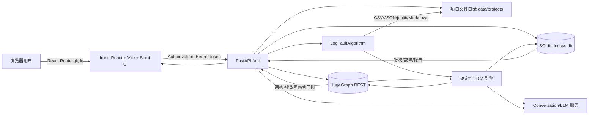
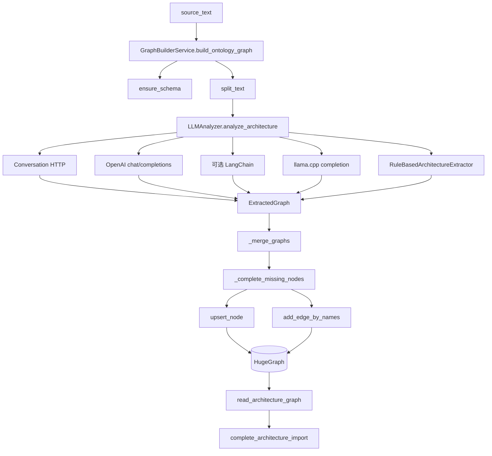

# LogScope RCA 系统运维 SOP 与全链路数据处理说明

> 文档用途：交接、部署、日常运维、数据核查、故障排查和验收。
> 适用代码基线：`main` 分支，提交 `c0460a0`（2026-08-24）。
> 编写依据：以当前源码为准；根目录旧 README 和部分历史设计文档中的 `frontend-system`、原生前端等描述已经过时。
> 主要代码根目录：`backend/`、`front/`。
> 时间约定：SQLite 的业务时间由后端以 UTC ISO 8601 字符串写入；日志事件时间不带时区，按日志原始时间解释。

---

## 1. 文档目标与阅读顺序

本系统的核心不是单一数据库或单一算法，而是四条数据链共同组成的闭环：

1. 用户、项目、批次、故障状态和报告状态保存在 SQLite。
2. 原始上传文件、日志算法中间结果和报告文件保存在本地磁盘。
3. 静态系统架构、动态故障证据和 RCA 关系保存在 HugeGraph。
4. 架构抽取与最终 RCA 文字决策会调用远程或本地大模型。

运维人员建议按以下顺序阅读：

1. 第 2～4 章：先理解组件、数据源和目录。
2. 第 6～12 章：理解每条完整数据链。
3. 第 15 章：按标准流程操作系统。
4. 第 17 章：按症状排障。
5. 第 18～20 章：执行备份、恢复和验收。

---

## 2. 系统全景



### 2.1 组件职责

| 组件 | 主要职责 | 不承担的职责 |
|---|---|---|
| `front/` | 登录、项目、架构图谱、日志批次、故障详情、综合报告、管理员图谱管理；D3 绘图 | 不执行日志模型和根因算法 |
| FastAPI | 鉴权、权限判断、文件接收、后台任务编排、数据转换、REST API | 不用 SQLite 做拓扑搜索 |
| SQLite | 用户、会话、项目、任务状态、故障业务状态、报告状态、审计记录 | 不保存完整图拓扑 |
| 本地文件系统 | 原始日志、算法中间文件、模型对象、RCA 产物、综合报告文件 | 不承担项目权限判断 |
| HugeGraph | 静态架构节点/边、动态 Incident/LogEvent/Exception/RCA 节点和关系 | 不保存登录会话和“已解决”业务状态 |
| LogFaultAlgorithm | Spring 日志结构化、Drain、窗口特征、PCA、异常检测、故障 episode 聚合 | 不知道真实架构和项目权限 |
| `RootCauseEngine` | 实体对齐、故障信号分类、图路径搜索、Top-K 启发式排序 | 分数不是经过校准的真实概率 |
| `RcaDecisionService` | 在完整架构约束下选择/解释最终根因、组织用户可读传播链和排查步骤 | 不允许编造图中不存在的节点、IP 或端口 |

### 2.2 一条批次的主数据流

```text
上传 .log/.zip
  -> log_batches(processing)
  -> 原始文件 data/projects/<project>/logs/<batch>/
  -> load_events() 生成事件表
  -> template_events() 生成模板
  -> build_window_features() 生成窗口特征
  -> fit_and_detect() 生成异常分数
  -> annotate_windows()/merge_anomaly_windows() 生成 Incident 详情
  -> incident_details.json
  -> RootCauseEngine.analyze() 生成确定性 Top-K
  -> RcaDecisionService.enrich() 生成架构约束的最终决策
  -> IncidentGraphIntegrator 写 HugeGraph 动态子图
  -> _persist_incidents() 写 SQLite incidents
  -> rca_results.json / kg_rca_report.md
  -> log_batches(completed)
  -> 用户显式点击“生成报告”
  -> build_log_batch_report() 汇总 SQLite 中该批次的故障
  -> report_json + comprehensive_diagnostic_report.json
```

---

## 3. 必须先知道的当前实现事实

以下内容直接影响运维判断：

1. 当前正式前端根目录是 `front/`，技术栈为 React 18、Vite、Semi Design、D3。根目录 `scripts/start-frontend.*` 仍指向已经不存在的 `frontend-system/serve.py`，不要使用这些脚本启动当前前端；应在 `front/` 下运行 Vite。
2. `backend/app/log_precheck.py` 已实现日志时间跨度、跨年、未来时间、分段和时间戳识别率预检，但当前 `/api/projects/{project_id}/logs/analyze` 没有调用它，前端也没有确认时间范围的交互。因此当前版本不会在分析前自动拦截几年以前与当前日志混传。
3. 前端上传框宣称支持 `.txt`，但当前实际日志算法 `load_events()` 只直接接受 `.log`，ZIP 中也只发现 `.log`。直接上传 `.txt` 通常会在后台分析阶段失败。
4. 架构上传接口把文件按 UTF-8 文本解码；当前页面只引导 `.md/.txt`。它不会解析 PDF、Word 的版式或附件。
5. “综合分析报告”的当前实现是对已持久化 RCA 数据进行确定性统计汇总，`build_log_batch_report()` 本身不调用大模型。页面上的“智能分析”表示异步汇总流程，不表示又执行一次 LLM 推理。
6. 架构导入和日志分析使用进程内 `asyncio.create_task()`；服务进程重启后，正在执行的任务不会自动恢复，SQLite 可能留下 `processing` 状态。
7. HugeGraph 项目隔离通过节点名 `project::<project_id>::<display_name>` 和 `meta.project_id` 实现；读取时先拉取有界全局快照，再在 Python 内过滤。它适合当前规模，不是服务端强隔离。
8. 架构导入直接增量写入在线图谱，没有“草稿—审核—发布”状态，也没有版本回滚。`architecture_imports.graph_snapshot_json` 是完成时快照，但当前没有恢复接口。
9. 故障状态以 SQLite `incidents.status` 为准；HugeGraph 中的 Incident 节点不是工单状态源。直接改 HugeGraph 不会改变页面的待处理/已解决数量。
10. 批次删除会先删除本地文件和 SQLite，再异步清理 HugeGraph。接口返回成功时，图数据库清理可能仍在后台执行。
11. 前端 D3 绘图最多取 500 个节点和 1200 条边；后端或 HugeGraph 中数据更多时，页面可能只绘制前一部分，但数据并不一定丢失。

这些现状应纳入发布说明和验收结论，不应仅凭页面文案推断能力已经接通。

---

## 4. 目录与数据落点

### 4.1 代码目录

| 路径 | 内容 |
|---|---|
| `backend/app/main.py` | FastAPI 应用入口、中间件、健康检查和旧兼容接口 |
| `backend/app/system_api.py` | 当前系统正式 `/api` 接口和业务流程编排 |
| `backend/app/system_db.py` | SQLite 建表、迁移和仓储函数 |
| `backend/app/analyzer.py` | 架构 LLM 抽取、JSON 修复、规则兜底 |
| `backend/app/service.py` | 架构分片、合并、补端点和写 HugeGraph |
| `backend/app/hugegraph_client.py` | HugeGraph REST、Schema、CRUD 和通用读模型 |
| `backend/app/scoped_graph.py` | 项目命名空间、静态架构投影、故障融合子图 |
| `backend/app/log_integration.py` | LogFaultAlgorithm 适配、Incident 导入、动态图写入 |
| `backend/app/rca_engine.py` | 确定性 RCA 候选、图搜索、评分和验证建议 |
| `backend/app/rca_decision.py` | 完整架构压缩、Conversation LLM 调用、结果校验和实例清单 |
| `backend/app/log_compression.py` | 送给 LLM 的时间线压缩 |
| `backend/app/rca_optimization.py` | 图谱写入前的时间线选择和 RCA 子图剪枝 |
| `backend/app/log_reports.py` | 批次综合报告汇总 |
| `backend/app/graph_admin.py` | 管理员图谱状态、质量、导出、预览和维护 |
| `backend/lib/logfault/` | 仓库内置的日志算法实现；运行时也可加载外部 `LogFaultAlgorithm` |
| `front/src/utils/api.js` | 前端所有正式 API 映射 |
| `front/src/pages/` | 页面级 React 组件 |
| `front/src/tools/graph-view.js` | D3 力导向/泳道布局、拖拽、缩放、搜索聚焦和选中交互 |
| `front/src/tools/graph-semantics.js` | 故障图内部节点过滤、模型/算法传播链语义 |
| `front/src/tools/taskManager.js` | 1.5 秒轮询后台任务 |

### 4.2 运行数据目录

默认配置使用相对路径，最终位置取决于启动后端时的当前工作目录。推荐在生产 `.env` 中配置绝对路径。

以从 `backend/` 目录启动为例：

```text
backend/
└── data/
    ├── logsys.db
    ├── logsys.db-wal              # SQLite WAL，运行时可能存在
    ├── logsys.db-shm              # SQLite 共享内存，运行时可能存在
    └── projects/
        └── <project_id>/
            └── logs/
                └── <batch_id>/
                    ├── <原始日志文件或ZIP>
                    ├── <可选训练日志文件>
                    └── output/
                        ├── events.csv
                        ├── templates.csv
                        ├── window_features.csv
                        ├── window_embeddings.csv
                        ├── anomaly_windows.csv
                        ├── incidents.csv
                        ├── incident_details.json
                        ├── event_incident_mapping.csv
                        ├── exception_incident_mapping.csv
                        ├── unassigned_error_events.csv
                        ├── effective_config.json
                        ├── model_artifacts.joblib
                        ├── report.md
                        ├── summary.json
                        ├── rca_results.json
                        ├── kg_rca_report.md
                        └── comprehensive_diagnostic_report.json
```

架构上传的原文当前不单独写文件，而是保存在 SQLite `architecture_imports.source_text`。

### 4.3 三个权威数据源

| 业务问题 | 权威数据源 | 说明 |
|---|---|---|
| 用户是否可登录 | SQLite `users`、`sessions` | Token 明文只在浏览器，SQLite 保存 SHA-256 摘要 |
| 项目、批次、故障状态、解决说明 | SQLite | 页面统计主要查询这里 |
| 系统架构节点和关系 | HugeGraph | SQLite 只保留架构导入记录与快照 |
| 日志算法原始证据 | 批次 `output/` 文件 | `events.csv`、`incident_details.json` 等 |
| 页面故障详情快照 | SQLite `incidents.analysis_json/detail_json` | 由本次分析结果复制并持久化 |
| 故障融合图 | HugeGraph | 由 `read_incident_graph()` 动态读取 |
| 综合报告 | SQLite `log_batches.report_json` + 文件 | GET 报告时会按最新故障状态重新汇总并覆盖数据库 JSON |

---

## 5. 配置项与运行依赖

### 5.1 核心环境变量

| 配置 | 默认值 | 作用 |
|---|---|---|
| `APP_DATA_ROOT` | `./data` | 项目文件根目录 |
| `APP_DATABASE_PATH` | `./data/logsys.db` | SQLite 文件 |
| `SESSION_EXPIRE_HOURS` | `24` | 登录会话有效期 |
| `ALLOW_REGISTRATION` | `true` | 是否允许后续用户自助注册；首用户仍可注册 |
| `MAX_UPLOAD_MB` | `200` | HTTP 上传原始文件最大值 |
| `LLM_ENABLED` | `true` | 架构抽取是否启用模型 |
| `LLM_BASE_URL` | `http://127.0.0.1:1234` | OpenAI 兼容/llama.cpp 地址 |
| `LLM_MODEL` | `qwen3.5_14B_Q4_K_M` | 架构抽取模型名 |
| `LLM_API_KEY` | `not-needed` | OpenAI 兼容接口认证值 |
| `LLM_CHUNK_CHARS` | `700` | 架构文档分片字符数 |
| `LLM_MAX_TOKENS` | `2048` | 架构抽取响应上限 |
| `HUGEGRAPH_HOST/PORT` | `127.0.0.1/8080` | HugeGraph 地址 |
| `HUGEGRAPH_GRAPHSPACE` | `DEFAULT` | HugeGraph 图空间 |
| `HUGEGRAPH_GRAPH` | `hugegraph` | 图名 |
| `HUGEGRAPH_NODE_LABEL` | `LogSysKGNodeV7` | 顶点标签 |
| `HUGEGRAPH_EDGE_LABEL` | `LOGSYS_KG_RELATION_V7` | 边标签 |
| `LOGFAULT_PROJECT_PATH` | 空 | 外部 LogFaultAlgorithm 路径；为空时尝试仓库同级目录 |
| `LOGFAULT_CONFIG_PATH` | 空 | 日志算法 YAML 配置路径 |
| `RCA_TOP_K` | `5` | 确定性根因候选数 |
| `RCA_DECISION_ENABLED` | `true` | 是否调用 Conversation 决策模型 |
| `RCA_DECISION_URL` | `http://127.0.0.1/api/conversation` | 决策模型接口 |
| `RCA_DECISION_MODEL_CONFIG_ID` | 空 | 远程模型配置 ID |
| `LOG_COMPRESSION_MAX_CHARS` | `12000` | 送给决策模型的日志上下文字数预算 |
| `LOG_COMPRESSION_MAX_EVENTS` | `48` | 关键日志最大条数 |
| `RCA_GRAPH_PRUNING_ENABLED` | `true` | 是否在写 HugeGraph 前剪枝动态子图 |

完整默认值以 `backend/app/config.py` 的 `Settings` 为准。当前 `backend/.env.example` 没列出全部 RCA 决策和图剪枝变量，升级环境时要对照源码补齐。

### 5.2 大模型请求的工号与会话规则

1. 注册必须提供 `employee_id`。
2. 架构导入和日志 RCA 前，接口再次校验当前用户工号非空。
3. `LLMAnalyzer` 调用 OpenAI 兼容接口和 `RcaDecisionService` 调用 Conversation 接口时，请求头均带 `X-Ai-Coding-Key: <employee_id>`。
4. 架构抽取 `RcaDecisionService(..., continue_conversation=False)`，不会向请求体传 `conversation_id`。
5. 一次日志批次只创建一个 `IncidentGraphIntegrator` 和一个 `RcaDecisionService`：该批次第一个 Incident 请求不带 `conversation_id`；取得返回值后，后续 Incident 会带该 ID。
6. 每个 Incident 的请求内容仍包含完整压缩架构 `architecture_graph`，不依赖前一个请求补全拓扑。因此并发顺序不会决定某次请求是否有完整架构。
7. 环境变量不保存业务 `conversation_id`；进程内服务对象销毁后该 ID 不再复用。

### 5.3 依赖

- 后端：Python、FastAPI、Uvicorn、requests、Pydantic、python-multipart、json-repair、LangChain 可选组件。
- 日志算法：pandas、numpy、scikit-learn、joblib、PyYAML、drain3 等，通常由同级 `LogFaultAlgorithm/requirements.txt` 安装。
- 前端：Node.js/npm、React、Vite、Semi UI、D3。
- 外部服务：HugeGraph REST、Conversation/LLM 服务。

---

## 6. 认证、用户与项目数据链

### 6.1 注册

| 步骤 | 输入 | 函数/接口 | 转换结果 | 存储 | 下游输入 |
|---:|---|---|---|---|---|
| 1 | `username/password/display_name/employee_id` | `POST /api/auth/register` → `register()` | 去首尾空格，校验工号 | 无 | `create_user()` |
| 2 | 明文密码 | `hash_password()` | PBKDF2-SHA256，随机 16 字节 salt，260000 次迭代 | `users.password_hash` | 登录校验 |
| 3 | 用户资料 | `SystemDatabase.create_user()` | UUID 用户 ID；系统首用户自动为 `admin`，后续为 `user` | `users` | 会话签发 |
| 4 | 用户 ID | `issue_session()` | 随机 URL-safe Token；计算过期时间 | `sessions.token_hash` 保存 Token 的 SHA-256 | 返回浏览器 |
| 5 | Token | 前端 `acceptSession()`/`setToken()` | 明文 Token 写浏览器 `localStorage.logscope_token` | 浏览器 localStorage | 后续 API Authorization 头 |

### 6.2 登录与鉴权

```text
LoginRequest
 -> get_user_by_username()
 -> verify_password()
 -> issue_session()
 -> 浏览器保存明文 token
 -> request() 添加 Authorization: Bearer <token>
 -> require_user()
 -> token_hash()
 -> sessions JOIN users，校验过期和 is_active=1
 -> 当前用户对象
```

退出调用 `POST /api/auth/logout`，只删除当前 `sessions` 行。过期会话可由 `cleanup_sessions()` 删除，但当前没有定时任务自动调用，需运维定期清理。

### 6.3 权限规则

- 普通用户只能访问自己创建的项目。
- 管理员可访问所有未归档项目，并管理用户和 HugeGraph。
- `_project_for_user()` 对无权限项目返回 404，避免泄露项目 ID。
- HugeGraph 管理接口统一调用 `_require_admin()`，不设置第三种图谱管理员角色。
- 管理员自身不能降级为普通用户；管理员账号不能被停用。

### 6.4 项目

`POST /api/projects` 调用 `create_project()`，生成 UUID 并写 `projects`。项目 ID 随后同时作为：

- SQLite 外键；
- 本地目录的一层路径；
- HugeGraph 内部节点名前缀；
- HugeGraph 节点/边 `meta.project_id`。

项目删除调用链：

```text
DELETE /api/projects/<project_id>
 -> _project_for_user()
 -> BackgroundTasks: ProjectScopedGraphClient.clear_project_graph()
 -> SystemDatabase.delete_project()，SQLite 外键级联
 -> shutil.rmtree(APP_DATA_ROOT/projects/<project_id>)
 -> 返回 project_deleted
```

HugeGraph 清理是后台动作，删除成功响应不等于图节点已立即全部消失。

---

## 7. 架构文档导入全链路

### 7.1 输入契约

推荐输入 UTF-8 `.md` 或 `.txt`，内容至少应包含：

- 节点名称和类型：Service、API、Database、Cache、Cluster、Instance、Host、Pod 等；
- 调用者到被依赖者的有向关系；
- 集群到成员的 `HAS_MEMBER`/`CONTAINS`，或成员到聚合节点的 `BELONGS_TO`/`MEMBER_OF`；
- 日志侧别名，如 `api-gateway` 与“API 网关”；
- 实例的 `host/ip/port/endpoints/instance_id/pod` 等元数据。

推荐示例：

```text
API网关（日志别名 api-gateway）调用安全服务（日志别名 security-service）。
安全服务依赖 Redis生产集群。
Redis生产集群包含 redis-1、redis-2、redis-3。
redis-1 ip=10.0.2.11 port=6379。
redis-2 ip=10.0.2.12 port=6379。
redis-3 ip=10.0.2.13 port=6379。
```

### 7.2 上传到任务创建

| 步骤 | 输入 | 函数 | 处理后数据 | 存储/输出 |
|---:|---|---|---|---|
| 1 | 浏览器文件 | `ArchitecturePage.submitArchitecture()` | `FormData(file,name)` | POST `/api/projects/{id}/architectures/import` |
| 2 | `UploadFile` | `_read_upload()` | bytes；检查非空和 `MAX_UPLOAD_MB` | 内存 |
| 3 | bytes | `decode('utf-8', errors='replace')` | 架构原文字符串 | 传给数据库 |
| 4 | 项目/文件/原文/用户 | `create_architecture_import()` | `status=processing, progress=5` | `architecture_imports` |
| 5 | 任务参数 | `asyncio.create_task(_run_architecture_import_task(...))` | 进程内后台任务 | API 立即返回 202 |

### 7.3 抽取与写图



关键函数转换：

1. `split_text(text, LLM_CHUNK_CHARS)` 按段落和句子把长文档拆为字符块。
2. `LLMAnalyzer._build_user_prompt()` 要求模型返回 `services/calls` JSON。
3. `_parse_json_lenient()` 去除 `<think>`/代码块并尝试 `json_repair`。
4. `_normalize_graph()` 接受 `services/nodes/vertices` 和 `calls/edges/relations` 等兼容字段，归一为 `ExtractedGraph`。
5. LLM 全部失败时 `RuleBasedArchitectureExtractor.extract()` 用规则提取服务、集群、成员、调用、数据库依赖和部分元数据。
6. `_merge_graphs()` 按节点名合并分片，按 `(source,target,type)` 去重关系。
7. `_complete_missing_nodes()` 为关系中缺失的端点补建 `Component` 节点。
8. `ProjectScopedGraphClient.upsert_node()` 将显示名变为内部名 `project::<project_id>::<name>`，并把 `project_id/display_name` 写入 meta。
9. `HugeGraphRestClient.upsert_node()` 先按主键查找；存在则 PUT 更新，不存在才 POST，新旧导入因此是增量覆盖同名节点。
10. 所有节点完成后，`add_edge_by_names()` 再按名称解析真实顶点 ID 并写边，避免节点更新响应未返回 ID 导致边丢失。

### 7.4 架构导入输出

完成后：

- HugeGraph 保存当前在线架构。
- `architecture_imports.extracted_nodes/extracted_edges` 保存本次抽取数。
- `execution_logs_json` 保存 Schema、模型模式和写入日志。
- `graph_snapshot_json` 保存完成时项目静态架构快照。
- `status/progress/completed_at` 更新为完成。

失败时 `fail_architecture_import()` 把错误写入 `error_message`；已经在失败前写入 HugeGraph 的节点/边不会自动回滚。

### 7.5 架构数据如何成为 RCA 输入

日志批次进入 RCA 时，`IncidentGraphIntegrator._import_details()` 调用：

```text
ProjectScopedGraphClient.read_architecture_graph(limit=5000)
 -> 过滤 Incident/Trace/LogEvent/Exception/RCAHypothesis 等动态节点
 -> GraphResponse(nodes, edges)
 -> RootCauseEngine(architecture)
 -> RcaDecisionService.enrich(..., architecture)
```

因此修改架构只影响之后新执行的 RCA；已经保存在 SQLite 的历史 `analysis_json` 不会自动重算。

---

## 8. 架构图谱人工 CRUD 数据链

### 8.1 节点

| 操作 | API | 核心函数 | 数据变化 |
|---|---|---|---|
| 新增 | POST `/projects/{id}/graph/nodes` | `ProjectScopedGraphClient.upsert_node()` | 同名内部主键存在时更新，不存在时新增 |
| 编辑属性 | PUT `/graph/nodes/{name}` | `update_node_by_name()` | 原名不变时 PUT append 属性 |
| 改名 | 同上 | scoped `update_node_by_name()` | 新建新主键节点 → 迁移全部相邻边 → 删除旧节点 |
| 删除 | POST `/graph/nodes/batch-delete` | `delete_node_by_name()` | 先删相邻边，再删顶点 |
| 批量删除 | POST `/graph/nodes/batch-delete` | `batch_delete_nodes()` | 对去重后的名称逐个级联删除 |

注意：HugeGraph 顶点标签采用 `PRIMARY_KEY`，节点名即业务主键。不能把改名当作普通属性更新。

### 8.2 边

边录入方向必须是：

```text
调用方/依赖方 -> 被调用方/被依赖方
```

`relation_key = source_vertex_id | relation_type | target_vertex_id`，它是边的 sort key。创建重复同型边时客户端会把 HugeGraph 的 duplicate/exist 响应视为已存在。

边编辑执行“删旧边 → 建新边”；建新边失败时尽力恢复旧边。删除按 `(source,target,type)` 扫描匹配。

### 8.3 直接 JSON 导入/导出

- 导出：`GET /graph/export` 返回当前静态架构节点和边，不包含动态故障节点。
- 导入：`POST /graph/import` 逐项调用 `upsert_node()` 和 `add_edge_by_names()`，跳过 LLM。
- 导入不是事务：中途某条失败，之前写入的数据不会回滚。

---

## 9. 日志上传与异常检测全链路

### 9.1 当前实际输入约束

| 项目 | 当前实现 |
|---|---|
| HTTP 原始大小 | 不超过 `MAX_UPLOAD_MB`，默认 200 MB |
| 页面允许后缀 | `.log/.txt/.zip` |
| 算法实际支持 | 单个 `.log`，或包含 `.log` 的 ZIP；目录仅供内部调用 |
| ZIP 路径安全 | 算法解压检查目标仍在临时目录内 |
| 日志格式 | 固定 Spring 风格首行正则，异常栈续行并入上一事件 |
| 时间范围预检 | 已有函数但未接入正式上传链路 |
| 正常训练集 | 后端支持 `train_file`，当前页面没有上传训练集控件 |

支持的首行示例：

```text
26/01/20 14:12:21.240 ERROR --- [http-nio-7100-exec-11] com.demo.Service : [trace-id] message
```

### 9.2 上传和批次创建

| 步骤 | 输入 | 函数 | 输出 | 存储 |
|---:|---|---|---|---|
| 1 | 文件 | `LogsPage.submit()` | `FormData(file)` | POST `/logs/analyze` |
| 2 | 文件 | `_read_upload()` | bytes | 内存 |
| 3 | UUID | `_data_dir(project,'logs',batch)` | 批次工作目录 | 磁盘 |
| 4 | bytes | `Path.write_bytes()` | 原始文件 | `<batch>/<filename>` |
| 5 | 路径和用户 | `create_log_batch()` | `processing, progress=5` | `log_batches` |
| 6 | 参数 | `asyncio.create_task(_run_log_analysis_task())` | 进程内后台任务 | API 202 返回 |

前端 `taskManager` 每 1.5 秒调用 `/tasks/active`。该接口只返回 SQLite 中 `status='processing'` 的架构任务和日志任务。任务从列表消失时，前端把它当作“完成”并刷新页面；这也可能是失败，因此最终应查看批次 `status/error_message`，不能只相信完成 Toast。

### 9.3 日志结构化：`load_events()`

```text
原始 .log/ZIP
 -> discover_log_files()
 -> parse_log_file()
 -> ParsedEvent 列表
 -> pandas.DataFrame
 -> 按 timestamp/source_file/source_line 排序
```

每条事件主要字段：

| 字段 | 来源/处理 |
|---|---|
| `timestamp` | 首行时间戳解析为 datetime |
| `level/thread/logger/message` | Spring 首行正则捕获 |
| `service` | 文件名去 `-err/-debug` 和末尾端口，例如 `api-gateway-7000.log` → `api-gateway` |
| `instance` | 日志文件父目录名 |
| `trace_id` | 消息前缀或内联 `trace_id/request_id/...` |
| `downstream_target` | 内联 downstream/target host 等字段 |
| `exception_class` | 最外层异常类 |
| `root_exception_class` | 最深 `Caused by` 的非 suppressed 异常类 |
| `root_cause` | 根异常类 + 根异常消息 |
| `exception_chain` | JSON 字符串，保存 direct/caused_by/suppressed 链 |
| `raw_block` | 首行和完整续行堆栈 |
| `source_file/source_line` | ZIP 内相对文件和首行号 |
| `event_id` | `<source_file>:<source_line>` |

没有解析出符合格式的事件时，批次失败。

### 9.4 模板化：`template_events()`

输入是事件 DataFrame 的 `semantic_message`。Drain3 或内置 fallback 将 UUID、IP、数字、耗时等变量掩码，输出：

- 原事件表新增 `template_id/template`；
- `templates.csv`：`template_id/template/occurrences`；
- `parser_backend`：`drain3` 或 `fallback`。

正式验收应检查 `summary.json.parser_backend`；出现 `fallback` 表示没有使用官方 Drain3。

### 9.5 窗口特征：`build_window_features()`

默认窗口大小 5 分钟，步长 1 分钟。特征名默认是：

```text
<service>::<template_id>
```

函数输出：

- `metadata`：`window_id/window_start/window_end/event_count`；
- `matrix`：每个窗口内每个服务模板的出现次数。

二者拼接后保存为 `window_features.csv`。

### 9.6 标准化、PCA 和异常模型：`fit_and_detect()`

处理顺序：

1. 有训练集时对齐训练与目标特征列；无训练集时用目标窗口自身训练。
2. `StandardScaler.fit_transform()` 做 Z-score 标准化。
3. PCA 最多 20 个主成分。
4. 默认 Isolation Forest：300 棵树，`contamination=0.03`，随机种子 42；也支持 One-Class SVM。
5. `-decision_function` 得到 `anomaly_score`；预测为 `-1` 得到 `model_is_anomaly=true`。

输出：

- `window_embeddings.csv`；
- `model_artifacts.joblib`，包含 scaler/PCA/detector/feature_names；
- 内存中的 `DetectionResult` 供下一步解释。

### 9.7 规则保护和异常窗口：`annotate_windows()`

模型异常不是唯一入口。该函数同时检查：

- 模型是否异常；
- ERROR/FATAL 是否属于技术故障；
- 是否命中已知 Redis、数据库、网络、超时、类加载等根因信号。

只要命中启用的来源，最终 `is_anomaly=true`，并在 `anomaly_reason` 标注 `model`、`technical_error_rule` 或 `root_signal_rule`。结果保存为 `anomaly_windows.csv`。

### 9.8 故障 episode 聚合：`merge_anomaly_windows()`

该函数把“异常窗口”转为“故障 Incident”，不是一条 ERROR 建一个故障，也不是一个 trace 建一个故障。

主要步骤：

1. `_merge_window_regions()` 合并相邻异常窗口。
2. `_build_seeds()` 选择技术 ERROR、模型支持的业务 ERROR 或模型-only WARN 区域。
3. `_cluster_error_indices()` 按异常签名、故障族、服务、trace 和时间兼容性聚成故障 episode。
4. `_timeline_for_seed()` 取故障前 60 秒、后 120 秒以及同 trace 窗口内事件。
5. `_rank_candidates()` 对主 ERROR 候选评分，每个异常类先保留一个代表，再补满候选。
6. `_limit_timeline()` 默认最多保留 300 条展示时间线；主 ERROR 的审计映射不会因展示预算丢失。

输出五类数据：

| 输出 | 保存位置 | 下游用途 |
|---|---|---|
| `incidents` DataFrame | `incidents.csv` | 批次概览 |
| `incident_details` list | `incident_details.json` | 图谱 RCA 的核心输入 |
| `event_mapping` | `event_incident_mapping.csv` | 审计每条事件属于哪个 Incident |
| `exception_mapping` | `exception_incident_mapping.csv` | 审计异常类归属 |
| `unassigned_errors` | `unassigned_error_events.csv` | 未提升为系统故障的 ERROR/FATAL |

`incident_details.json` 每项关键字段：

- `incident_id`：算法内编号，如 `I00001`；
- `fault_start/fault_end`；
- `services/trace_ids/primary_trace_id`；
- `root_service_candidate`；
- `root_cause_candidate/root_exception_class`；
- `root_evidence`；
- `root_candidates`；
- `exception_summary`；
- `timeline`。

### 9.9 `run_pipeline()` 最终输出

`run_pipeline()` 顺序写出所有 CSV/JSON/joblib/Markdown，并返回 `summary`：

```json
{
  "events": 0,
  "templates": 0,
  "windows": 0,
  "model_anomaly_windows": 0,
  "anomaly_windows": 0,
  "incidents": 0,
  "pca_components": 0,
  "pca_explained_variance": 0,
  "parser_backend": "drain3",
  "model": "isolation_forest"
}
```

该 summary 随后作为 `IncidentGraphIntegrator` 的同批次输入，并最终写入 `log_batches.summary_json`。

---

## 10. 日志结果与知识图谱融合、RCA 全链路

### 10.1 导入入口

`_run_log_analysis_task()` 在日志算法完成后执行：

```text
IncidentGraphIntegrator(ProjectScopedGraphClient(project_id), employee_id)
  .import_path(output_dir, input_file_name, batch_id[:12])
```

`import_path()` 从 `incident_details.json` 读取详情。每个算法 Incident ID 都加批次前 12 位前缀：

```text
I00001 -> <batch_id前12位>:I00001
```

这样同一项目不同日志批次不会在 HugeGraph 中覆盖同名动态节点。

### 10.2 架构快照成为两个推理器的输入

`_import_details()` 先读取一次项目静态架构：

- `_known_nodes`：写图时防止日志数据覆盖人工架构节点；
- `_architecture_nodes`：验证模型输出必须落在真实架构节点；
- `RootCauseEngine(architecture)`：确定性候选和路径；
- `RcaDecisionService.enrich(..., architecture)`：大模型最终决策。

### 10.3 确定性 RCA：`RootCauseEngine.analyze()`

每个 `detail` 的处理：

1. `ArchitectureSnapshot` 过滤所有动态节点，只保留静态架构。
2. `resolve(root_service_candidate)` 用名称、别名、service、instance、host、IP、endpoint 等标识对齐架构锚点。
3. `_signals()` 从根异常、候选日志和时间线识别 Redis、数据库、消息队列、网络、OOM、磁盘、CPU、认证、熔断等故障模式。
4. `_endpoint_tokens()` 抽取日志中的 host/IP/port/endpoint。
5. 普通服务锚点使用 `paths_from()` 沿依赖方向搜索；Host/Instance 锚点使用 `paths_to()` 反向找受影响服务。
6. 候选得分综合故障基础分、资源文本匹配、kind 匹配、拓扑距离、endpoint 直接证据、集群加权和多信号佐证。
7. `_dedupe_candidates()` 按候选节点去重并保留最高分。
8. `_hypothesis()` 生成 `RootCauseHypothesis`，包含 chain、evidence、reasons、missing_evidence 和人工验证建议。

依赖边存储方向和故障传播方向相反：

```text
存储：API网关 -> 安全服务 -> Redis集群 -> redis-2
传播：redis-2 -> Redis集群 -> 安全服务 -> API网关
```

`confidence` 是解释性启发式分数，不是“真实故障概率”。

### 10.4 送给大模型的数据如何压缩

`RcaDecisionService._build_prompt_with_meta()` 每个 Incident 都构建完整独立请求。

#### 日志压缩

`LogContextCompressor.compress()`：

- 按 FATAL/ERROR/WARN、OOM/连接拒绝/集群宕机等信号、根异常、稀有模板、证据词重叠评分；
- 保留强故障锚点前后 `context_radius` 条；
- 重复模式只保留代表日志并生成次数/首尾时间摘要；
- 默认最多 48 个关键事件、12000 字符；
- 输出 `summary/key_events/repeated_patterns`。

这只影响 LLM prompt，不会删除 `incident_details.json` 中的时间线。

#### 架构压缩

完整静态架构被转换为：

```json
{
  "ref": "sha256:16位指纹",
  "schema": {
    "n": ["id", "name", "t", "m?"],
    "e": ["sourceId", "targetId", "r", "m?"]
  },
  "n": [["节点ID", "节点名", "SV", {"ip": ["10.0.0.1"], "p": [8080]}]],
  "e": [["源ID", "目标ID", "D"]]
}
```

不发送 `layer`，`kind` 和 relation 使用短码；只允许以下运行元数据进入 prompt：别名、主机名、IP、端口、endpoint、实例 ID、service name、cluster、namespace、pod、protocol、region、zone、health check。密码、Token、Secret、私钥等会过滤或脱敏。

### 10.5 Conversation 模型调用

`_post_conversation()` 请求体包含：

- 完整 prompt；
- `model_config_id`；
- assistant role/name/prompt；
- 可选知识库 ID/名称；
- 第一次无 `conversation_id`，同批次后续 Incident 带第一次返回的 ID。

请求头包含 `X-Ai-Coding-Key`。响应可为普通 JSON 或 SSE；`_conversation_content()` 归并 chat/assistant 内容并抽取 `conversation_id`。

### 10.6 模型输出校验与实例收敛

`_normalize_model_result()` 不直接信任模型文本，而会：

1. `selected_node_id` 必须能在架构 catalog 中按 ID/名称/别名解析。
2. `_normalize_architecture_path()` 验证路径节点存在；相邻节点不直接连接时用最短路径补齐；完全不连通则忽略并记录 warning。
3. 排查步骤只能绑定真实 node ID。
4. 命令模板中的 `{host}/{ip}/{port}/{endpoint}/{node}` 由可信 meta 替换；出现未登记 IP、主机或端口时隐藏命令。
5. 如果日志只定位到聚合/集群节点，`_possible_member_nodes()` 沿 `HAS_MEMBER/CONTAINS/BELONGS_TO/MEMBER_OF` 展开真实成员。
6. 多成员且无直接证据：正式根因停在集群，成员进入 `possible_member_nodes`，状态为待排查。
7. 只有一个真实成员：正式根因自动下沉到该实例，并设置 `resolved_from_aggregate`。
8. 模型猜测某实例但日志没有该实例标识，而确定性算法只定位到其父集群：`_enforce_cluster_scope()` 将实例降为待排查成员。

最终 `llm_decision` 主要字段：

| 字段 | 含义 |
|---|---|
| `selected_candidate/selected_node_id` | 真实架构中的最终根因 |
| `selected_fault_mode` | 故障模式 |
| `most_likely_reasons` | 分条根因依据 |
| `troubleshooting_methods/checks` | 已绑定架构节点和运行元数据的排查步骤 |
| `propagation_path/display_chain` | 用户可读且经拓扑校验的传播链 |
| `possible_member_nodes` | 集群无法定位到单实例时的全部待排查实例 |
| `instance_resolution` | `resolved_instance/unresolved_members_listed/members_missing/not_applicable` |
| `selected_node_runtime` | 根因节点可信 host/IP/port/endpoint |
| `notes` | 模型建议补充的证据 |
| `path_validation_warnings` | 节点、路径、命令或成员关系校验告警 |
| `source` | `llm` 或 `fallback` |
| `conversation_id` | 本次服务返回的会话 ID |
| `log_compression` | 日志和架构压缩统计 |

模型调用/JSON/校验失败时，`_ground_fallback_in_architecture()` 使用确定性 Top-1，但仍执行架构落点、单成员下沉和成员清单展开。

### 10.7 写入 HugeGraph 动态子图

`IncidentGraphIntegrator._import_one()` 与 `_write_rca()` 创建：

| 节点 kind | 名称模式 | 来源 |
|---|---|---|
| `Incident` | `Incident:<batchPrefix>:I00001` | `incident_details` |
| `Trace` | `Trace:<trace_id>` | 主 trace |
| `LogEvent` | `LogEvent:<incident_id>:<序号>` | 剪枝后关键时间线 |
| `LogEvent` 候选 | `RootCandidate:<incident_id>:<排名>` | 根因候选日志 |
| `Exception` | `Exception:<异常类>` | 根异常和异常汇总 |
| `RCAHypothesis` | `RCAHypothesis:<incident_id>:<排名>` | 确定性 Top-K |
| `RCAHypothesis` | `RCAHypothesis:<incident_id>:LLM` | 模型最终决策 |

主要关系：

- Incident → `ROOT_SERVICE/OBSERVED_AT` → 架构服务；
- Incident → `HAS_EXCEPTION/HAS_TRACE/HAS_EVENT/HAS_HYPOTHESIS` → 动态证据；
- Incident → `SUSPECTED_ROOT_CAUSE` → 最终架构根因；
- RCAHypothesis → `CANDIDATE_CAUSE/AFFECTS/SUPPORTED_BY`；
- Service → `EMITS` → LogEvent；
- LogEvent → `TEMPORALLY_PRECEDES` → LogEvent。

写入前 `select_relevant_timeline()` 和 `prune_pending_graph()` 按设置控制事件数、重复模式、孤立节点和可选时序/共现边。它影响 HugeGraph 展示规模，不改变磁盘算法原始结果。

### 10.8 写入 SQLite 故障

`_persist_incidents()` 将算法详情和图谱 RCA 合并为业务故障：

```text
detail + analysis
 -> 以 external_incident_id 匹配
 -> 若 llm_decision.source == llm 且有 selected_node_id/path：使用模型根因、置信度和链路
 -> 否则使用确定性 Top-1
 -> confidence 映射 severity
 -> upsert incidents
 -> incident_actions(action=detected)
```

严重度映射：

- `>= 0.90`：critical；
- `>= 0.75`：high；
- `>= 0.50`：medium；
- 其他：low。

`incidents.analysis_json` 保存完整 `RootCauseAnalysis + llm_decision`；`detail_json` 保存 `incident_details.json` 的单项快照。

### 10.9 批次完成

最后写：

- `rca_results.json`：完整 RCA 数组；
- `kg_rca_report.md`：可读 Top-K/模型结论；
- `log_batches.summary_json`：算法 summary 加总耗时；
- `log_batches.rca_json`：本批次全部分析；
- `status=completed/progress=100`；
- 报告状态重置为 `not_generated`。

任一步异常时 `fail_log_batch()` 记录 `status=failed/error_message`。已经生成的文件或已经写入的部分 HugeGraph 数据不会自动事务回滚。

---

## 11. 故障列表、详情与状态闭环

### 11.1 故障列表

`GET /projects/{project_id}/incidents` 调用 `paginate_incidents()`，支持：

- `status`；
- `severity`；
- `batch_id`；
- 关键字匹配标题、根因、故障模式、外部 ID、日志文件名；
- `page/page_size`，最大 100。

响应加 `Cache-Control: no-store`。前端将筛选和页码保存在 URL 查询参数中，进入详情再返回时可恢复原页。

### 11.2 故障详情的两个数据源

页面加载同时取：

1. `GET /incidents/{incident_id}`：SQLite 中的业务故障、`analysis_json`、`detail_json` 和操作历史；
2. `GET /incidents/{incident_id}/graph`：HugeGraph 中该 Incident 的融合子图。

前端根因卡片优先使用 `analysis.llm_decision`，算法 Top-1 只做 fallback。关键日志和完整时间线来自 `detail_json`，图来自 HugeGraph；两者缺一时页面仍可能显示另一部分。

`filterIncidentGraph()` 会隐藏 Incident、RCAHypothesis、RootCandidate、Trace 等用户不易理解的内部节点；当前默认也不从图接口加载 LogEvent。传播高亮由 `buildIncidentSemantics()` 优先使用模型 `propagation_path`，否则使用算法 Top-1。

### 11.3 状态修改

```text
PATCH /incidents/<id>/status
 -> IncidentStatusRequest
 -> resolved 时必须有 resolution_note
 -> update_incident_status()
 -> incidents 状态/解决人/解决时间
 -> incident_actions 审计行
 -> 若批次报告已完成，立即按最新 incidents 重建 report_json
 -> 返回最新详情
```

状态可选：`open/in_progress/resolved/ignored`。

项目总览的数量来自 `SystemDatabase.dashboard()` 实时聚合 `incidents`；批次列表的 `resolved_count` 也实时聚合。因此通过正式 API 更新后应立即一致。直接改数据库后若页面已打开，仍需刷新或重新触发接口；HugeGraph 和磁盘不会随 SQLite 手工修改同步。

---

## 12. 综合分析报告数据链

### 12.1 生成条件和状态

用户必须在日志 RCA 批次 `status=completed` 后点击“生成报告”。

```text
POST /logs/<batch>/report/generate
 -> start_log_batch_report()
 -> report_status=processing
 -> BackgroundTasks: _run_log_report_task()
 -> _list_batch_incidents() 读取该批次完整 analysis/detail
 -> build_log_batch_report()
 -> report_json
 -> output/comprehensive_diagnostic_report.json
 -> report_status=completed
```

失败写 `report_status=failed/report_error_message`，页面允许重新生成。

### 12.2 `build_log_batch_report()` 的转换

输入是批次公开信息和该批次所有 SQLite 故障，输出：

| 字段 | 计算方式 |
|---|---|
| `summary` | 故障数、根因节点数、事件/窗口数、严重度、状态、解决率、平均置信度 |
| `node_frequencies` | 根因命中次数、传播链出现次数、关联故障数 |
| `fault_modes` | 故障模式分布、Top 根因节点 |
| `propagation_paths` | 去重链路及出现频次 |
| `executive_conclusions` | 基于上述统计生成最多 5 条描述 |
| `focus_nodes` | 高频根因节点、受影响节点、代表证据 |
| `governance_recommendations` | 高频节点、故障模式、未闭环故障和共性排查动作 |
| `incidents` | 报告用精简故障列表 |

### 12.3 为什么已解决数量能更新

`GET /logs/<batch>/report` 不直接原样返回旧 `report_json`，而是重新查询当前 `incidents` 并调用 `build_log_batch_report()`，随后覆盖数据库中的报告 JSON。因此故障状态变化后再次进入报告，统计应以数据库最新状态为准。

如果页面未变化，按以下顺序检查：

1. PATCH 状态接口是否返回 200；
2. SQLite `incidents.status` 是否真的更新；
3. 页面请求的 batch ID 是否与故障 `log_batch_id` 相同；
4. 浏览器是否实际发起 GET report；
5. 是否查看了旧静态导出文件，而不是页面实时报告。

---

## 13. HugeGraph Schema、项目隔离与读模型

### 13.1 Schema

所有业务顶点共用一个 vertex label，主要 property key：

| Property key | 含义 |
|---|---|
| `logsys_kg_name` | 内部唯一名称，PRIMARY KEY |
| `logsys_kg_layer` | 层级 |
| `logsys_kg_kind` | 节点类型 |
| `logsys_kg_description` | 描述 |
| `logsys_kg_source_file` | 来源文件 |
| `logsys_kg_meta` | 压缩 JSON 文本 |

所有关系共用一个 edge label，主要 property key：

| Property key | 含义 |
|---|---|
| `logsys_kg_relation_key` | source/type/target 唯一组合，sort key |
| `logsys_kg_relation_type` | 业务关系类型 |
| `logsys_kg_relation_desc` | 描述 |
| `logsys_kg_relation_meta` | JSON 文本 |

`ensure_schema()` 会自动创建 property/vertex/edge label 和 kind/type 二级索引。若发现旧 label 缺少必要字段，会在客户端实例内切换到 `<原名>_CRUD_FIXED`；运维看到数据突然分散时应检查实际 label。

### 13.2 项目隔离

显示名 `redis-1` 在项目内写成：

```text
project::<project_uuid>::redis-1
```

同时 meta 至少有：

```json
{"project_id":"<project_uuid>","display_name":"redis-1"}
```

`read_graph()` 拉取共享 label 的有界快照，按前缀或 `meta.project_id` 过滤，再把显示名还原给前端。

### 13.3 两种读模型

- `read_architecture_graph()`：过滤所有动态 kind 和临时发现服务，用于系统架构页面和 RCA 输入。
- `read_incident_graph()`：从一个 Incident 出发，选取假设、根因、观察服务、异常、trace、可选日志事件及相关架构链，用于根因详情。

因此 HugeGraph 中能查到节点但系统架构页看不到，常见原因是：

1. 节点 kind 被归类为动态节点；
2. `meta.dynamic_observation=true`；
3. 节点缺少正确项目命名空间；
4. 已超过读取或 D3 绘制上限；
5. 前端架构页存在内存 cache，尚未刷新；
6. Schema 自动切换后数据位于旧 label。

---

## 14. 管理员图谱管理

### 14.1 状态与概览

- `status()`：访问 HugeGraph `/versions` 和两个候选 REST base URL 的 `/schema`，返回延迟、选中 base、label 就绪情况和错误。
- `snapshot()`：最多扫描 50000 顶点、100000 边，映射项目和显示名。
- `overview()`：统计节点、边、架构/动态节点、未归属节点、无效边、类型分布和项目用量。
- `data()`：在内存快照上按项目、kind/relation、关键字过滤后分页。

达到扫描上限时 `scan.nodes_truncated/edges_truncated=true`，此时页面统计只是下限，不能作为全量审计结果。

### 14.2 质量检查

`quality()` 检查：

- 孤立节点；
- 无效边；
- 重复边组；
- 跨项目边；
- project_id 不存在的节点；
- 未归属项目节点。

孤立节点原因由 `_orphan_diagnosis()` 保守判断：人工未建关系、架构只抽到点未抽到边、动态写入中断、历史残留或缺少命名空间。最多返回每类 200 个样本。

### 14.3 安全维护操作

支持：

- `clear_project`：清空项目全部图数据；
- `cleanup_batch`：清理某批次动态节点；
- `delete_orphan_nodes`：删除选中的当前孤立节点。

统一流程：

```text
preview_operation()
 -> 重新扫描影响范围
 -> graph_admin_operations(status=previewed)
 -> 返回精确 confirmation_text
 -> 10 分钟内 execute_operation()
 -> 校验执行人、状态和确认文本
 -> 对孤立节点再次确认仍为孤立
 -> status=running
 -> 执行 HugeGraph 删除
 -> status=completed/failed + result/error
```

所有操作不可恢复。执行前必须先做项目图导出；清空项目还应同时备份 SQLite 和项目文件目录。

---

## 15. 标准操作流程（SOP）

### SOP-01：首次部署

1. 准备 Python、Node.js、HugeGraph、Conversation/LLM 服务和 LogFaultAlgorithm 依赖。
2. 创建 Python 虚拟环境并安装：

   ```powershell
   Set-Location E:\code\llm-hugegraph
   py -3 -m venv .venv
   .\.venv\Scripts\python.exe -m pip install -r backend\requirements.txt
   .\.venv\Scripts\python.exe -m pip install -r backend\requirements-dev.txt
   ```

3. 安装同级 `LogFaultAlgorithm` 的 requirements，或确保该包及其科学计算依赖已安装。
4. 复制并审核 `backend/.env.example` 为 `backend/.env`。生产必须把 `APP_DATA_ROOT` 和 `APP_DATABASE_PATH` 改为绝对路径。
5. 确认 `RCA_DECISION_*`、图剪枝和日志压缩变量已经按 `config.py` 补齐。
6. 启动 HugeGraph，确认 graphspace/graph 存在。
7. 从 `backend/` 启动后端：

   ```powershell
   Set-Location E:\code\llm-hugegraph\backend
   ..\.venv\Scripts\python.exe -m uvicorn app.main:app --host 0.0.0.0 --port 8000
   ```

8. 从 `front/` 启动前端：

   ```powershell
   Set-Location E:\code\llm-hugegraph\front
   npm install
   npm run dev -- --host 0.0.0.0 --port 5174
   ```

9. 不要使用当前 `scripts/start-frontend.ps1/.bat/.sh`，它们仍引用旧目录。
10. 检查 `/api/health` 和 `/api/debug/hugegraph`。`/api/debug/llm` 会真实调用模型并写一个无项目隔离的兼容测试图，生产环境不建议频繁执行。

### SOP-02：创建首个管理员和普通用户

1. 在空库中注册第一个账户，该账户自动成为管理员。
2. 注册时必须填写真实工号；该工号会作为远程模型请求头。
3. 管理员在“用户与权限管理”确认用户角色和启用状态。
4. 建议完成首个管理员创建后将 `ALLOW_REGISTRATION=false`，后续如需开户再临时开启或通过受控流程处理。
5. 不要手工把所有管理员停用；代码虽有接口保护，直接 SQL 不受保护。

### SOP-03：创建项目

1. 创建项目并记录项目 UUID。
2. 普通用户只能看到自己的项目，管理员可看到全站项目。
3. 在导入任何数据前确认项目名称、环境和负责人，避免把测试日志导入生产项目。

### SOP-04：导入并验收系统架构

1. 准备 UTF-8 `.md/.txt` 架构说明。
2. 必须明确依赖方向、日志别名、集群成员、IP 和端口。
3. 上传后观察任务进度，直到 `architecture_imports.status=completed`。
4. 在架构页检查节点数和关系数；不要只看导入完成状态。
5. 人工检查：
   - 调用边是否为“调用方 → 被依赖方”；
   - `api-gateway` 等日志名是否在对应节点 `meta.aliases/service_name`；
   - 集群是否有成员关系；
   - 每个实例是否有可信 `ip/port/endpoints`；
   - 是否有孤立节点和重复节点。
6. 使用“导出 JSON”保存验收基线。
7. 大模型规则 fallback 的导入必须重点人工复核。

### SOP-05：上传日志并监控批次

1. 当前只使用 `.log` 或包含 `.log` 的 ZIP。
2. 上传前人工检查所有日志属于同一次故障调查时间段；当前系统没有自动时间范围确认。
3. 建议 ZIP 内按服务/实例分目录，文件名保留 `<service>-<port>.log` 形式。
4. 不要混入几年前历史日志、未来时间日志、不同环境日志或 debug/err 重复副本。
5. 上传后记录 batch UUID。
6. 任务期间检查 `/tasks/active`、后端日志和 `log_batches.progress_message`。
7. 完成后检查：
   - `status=completed`；
   - `summary.events/windows/incidents` 非异常值；
   - `parser_backend=drain3`；
   - `output/incident_details.json` 存在；
   - `rca_results.json` 存在；
   - SQLite incidents 数与预期相符。
8. 失败时先保留批次目录和错误日志，定位后再删除或重新上传。

### SOP-06：核验根因详情

1. 从故障列表进入详情，确认页面批次与日志文件正确。
2. 核对最终根因、分条依据、排查步骤和传播图是否指向同一节点。
3. 根因是集群且日志无实例证据时，确认“待排查实例”列出全部真实成员及 IP/端口。
4. 聚合节点只有一个实例时，确认结论已下沉到该实例。
5. 若 `possible_member_nodes` 为空：
   - 检查集群 kind/name 是否可识别为聚合节点；
   - 检查成员边类型和方向；
   - 检查实例 kind 或运行 meta；
   - 检查 `member_resolution_warning/path_validation_warnings`。
6. 对照 `root_evidence`、关键日志和完整时间线，不把 `TEMPORALLY_PRECEDES` 当成因果证明。
7. 排查命令中的 IP/端口应来自架构 meta；如果被隐藏，先补充可信元数据再重新分析。

### SOP-07：处理并关闭故障

1. 状态先改为 `in_progress`。
2. 按排查步骤人工验证，不把启发式 confidence 当作确认结果。
3. 解决后选择 `resolved` 并填写可审计说明：实际根因、影响、操作、恢复时间和验证方式。
4. 返回项目总览和综合报告确认已解决数量更新。
5. 误报可标为 `ignored`，但应说明原因。

### SOP-08：生成综合分析报告

1. 进入左侧“故障根因定位 → 综合分析报告”。
2. 只对 RCA 已完成批次点击生成。
3. 页面可离开；报告状态保存在数据库。
4. 完成后检查节点故障频次、故障模式、传播路径、解决率和治理建议。
5. 修改故障状态后重新打开报告，确认按实时 incidents 重建。
6. 需要归档时同时保存页面结果和 `comprehensive_diagnostic_report.json`。

### SOP-09：图谱质量检查与安全删除

1. 仅管理员进入“图谱管理”。
2. 先检查 HugeGraph 在线和 Schema ready。
3. 选择项目执行质量检查。
4. 对孤立节点先看 `likely_reason/suggestion/deletion_risk`。
5. 优先补边；只有确认是误建或历史残留才删除。
6. 删除前导出项目图。
7. 生成影响预览，核对节点和边数量。
8. 在 10 分钟内输入精确确认文本并执行。
9. 刷新质量检查和操作审计，确认结果。

### SOP-10：删除错误日志批次

1. 记录 batch ID、关联故障数和是否已生成报告。
2. 如需审计，先复制整个批次目录并导出项目图。
3. 在日志批次页面执行删除。
4. 接口会立即删除本地目录和 SQLite 行，故障/动作通过外键级联。
5. HugeGraph 清理由后台重试最多 3 次；稍后在管理员图谱管理检查残留动态节点。
6. 删除不可恢复；不要将其当作“隐藏批次”。

---

## 16. SQLite 数据字典

### 16.1 `users`

`id, username, password_hash, display_name, employee_id, role, is_active, created_at, updated_at`

### 16.2 `sessions`

`token_hash, user_id, expires_at, created_at`。删除用户时级联删除会话。

### 16.3 `projects`

`id, owner_id, name, description, status, created_at, updated_at`。

### 16.4 `architecture_imports`

| 字段 | 说明 |
|---|---|
| `source_text` | 完整架构原文，可能包含内部地址，需纳入敏感数据保护 |
| `status/progress/progress_message` | 进程内后台任务状态 |
| `execution_logs_json` | 模型适配器与写图日志 |
| `graph_snapshot_json` | 完成时架构快照 |
| `error_message` | 失败信息，最多保存前 4000 字符 |

### 16.5 `log_batches`

| 字段 | 说明 |
|---|---|
| `input_path/train_path/output_path` | 本机绝对或解析后的路径 |
| `status/progress/progress_message` | 日志任务状态 |
| `summary_json` | 算法统计和阶段进度 |
| `rca_json` | 批次完整 RCA 数组 |
| `report_json/report_status` | 综合报告与生成状态 |
| `report_requested_by/at/generated_at` | 报告审计时间 |
| `error_message/report_error_message` | 两类任务错误 |

### 16.6 `incidents`

| 字段 | 说明 |
|---|---|
| `external_incident_id` | 算法原 ID，如 I00001 |
| `graph_incident_id` | 带批次前缀的图 ID |
| `root_candidate/root_confidence/fault_mode/chain_json` | 页面摘要字段 |
| `analysis_json` | 确定性 Top-K + llm_decision 完整快照 |
| `detail_json` | 日志算法详情快照 |
| `status/resolution_note/resolved_by/resolved_at` | 人工闭环字段 |

唯一约束：`project_id + log_batch_id + external_incident_id`。

### 16.7 `incident_actions`

保存 `detected/open/in_progress/resolved/ignored` 等动作、人员、说明和时间。

### 16.8 `graph_admin_operations`

保存管理员图操作的预览、确认文本、执行状态、结果和错误。预览有效期在业务逻辑中为 10 分钟。

---

## 17. 故障排查手册

| 症状 | 首查 | 关键函数/位置 | 常见原因 | 处理 |
|---|---|---|---|---|
| 无法登录 | `users/sessions` | `require_user()` | Token 过期、用户停用、浏览器 Token 旧 | 重新登录；核对 `expires_at/is_active` |
| 注册后模型 401/403 | 用户工号、模型日志 | `_post_conversation()` | 工号缺失/远程权限未配置 | 更新 employee_id，确认请求头策略 |
| 架构导入长期 processing | 后端进程和 `architecture_imports` | `_run_architecture_import_task()` | 进程重启、模型超时、任务丢失 | 查后端日志；确认无任务后将记录标失败并重新导入 |
| 架构导入完成但边少 | `execution_logs_json`、HugeGraph | `_complete_missing_nodes()/add_edge_by_names()` | LLM 未抽到关系、端点名不一致、边写失败 | 人工补边；检查文档表达和 Schema |
| HugeGraph 有节点但架构页没有 | kind/meta/prefix/limit | `read_architecture_graph()` | 动态节点、错误项目、前端 cache、绘图上限 | 校正 kind/meta，刷新页面，管理员查全局数据 |
| 同名节点删后重建异常 | HugeGraph 主键和 label | `upsert_node()/delete_node_by_name()` | 旧 label/边残留、删除未完成 | 查实际 label 和内部名；质量检查后清理 |
| 上传 `.txt` 后失败 | batch error | `load_events()` | 算法只直接接受 `.log` | 改为 `.log` 或 ZIP 中 `.log` |
| 未解析出日志事件 | `events.csv` 是否存在 | `LOG_START_RE/parse_log_file()` | 日志 pattern 不符合固定正则 | 调整日志格式或扩展解析器 |
| 事件很多但 Incident 为 0 | `anomaly_windows.csv`、unassigned | `annotate_windows/_build_seeds()` | 业务 ERROR 未被提升、模型无异常 | 核对规则配置和 `unassigned_error_events.csv` |
| RCA 根因与日志服务名称不一致 | aliases/meta | `ArchitectureSnapshot.resolve()` | 中英文/连字符别名缺失 | 在架构 meta 补 aliases/service_name，重新分析 |
| 根因停在服务，找不到 Redis | 架构依赖边 | `paths_from()` | 缺 DEPENDS_ON/READS/USES_DB | 补真实边后重新跑批次 |
| 待排查实例为空 | 成员关系和 kind/meta | `_possible_member_nodes()` | 无成员边、方向/类型不支持、成员不具运行标识 | 补 HAS_MEMBER 等关系与实例 meta，重新分析 |
| 模型路径跳点 | `path_validation_warnings` | `_normalize_architecture_path()` | 模型路径与真实拓扑不直接相邻 | 系统会补最短路径；校正架构或 prompt 输入 |
| 根因图为空 | `graph_incident_id` | `read_incident_graph()` | HugeGraph 动态节点写失败/被清理 | 用 SQLite ID 对照 HugeGraph 内部 Incident 名 |
| 详情有文字但图没有 | SQLite vs HugeGraph | 两个详情接口 | 只有 SQLite 快照成功 | 查图写入日志并视情况重新分析 |
| 图有数据但详情文字没有 | incidents 行 | `_persist_incidents()` | 图写成功后 SQLite 持久化失败 | 查 batch 失败点；从 rca_results 恢复需专门脚本 |
| 已解决数量不更新 | `incidents.status` | dashboard/report GET | 修改了错误库、页面未刷新、批次不一致 | 查实际 APP_DATABASE_PATH，刷新并核对 batch ID |
| 综合报告 409 | `report_status` | report endpoints | 未生成或正在生成 | 从报告中心发起，等待 completed |
| 管理员删除孤立节点提示状态变化 | 最新 quality | `execute_operation()` | 预览后节点已连边/被删 | 重新质量检查并生成预览 |
| 删除批次后图仍有节点 | HugeGraph | `_async_clean_batch_resources()` | 后台尚未完成或重试失败 | 查后端日志；管理员质量检查和受控清理 |
| HugeGraph 400 invalid vertex id | 内部名和编码 | `_encoded_id_candidates()` | 使用展示名当原生 ID、双重 URL 编码 | 只经客户端按名称解析，不直接拼 REST ID |
| 前端显示旧接口内容 | API base/localStorage | `front/src/utils/config.js` | `logscope_api_base` 指向旧后端 | 清理或更新 localStorage 配置 |

### 17.1 四段式追踪法

遇到任一批次问题，用同一个 `project_id/batch_id/external_incident_id` 依次追踪：

1. SQLite：`log_batches` 是否完成，错误和路径是什么。
2. 磁盘：`output/summary.json`、`incident_details.json`、`rca_results.json` 到哪一步存在。
3. SQLite：`incidents.analysis_json/detail_json` 是否写入。
4. HugeGraph：`Incident:<batch前12位>:<external_id>` 及关联边是否存在。

缺在哪一段，就从生成该段的函数排查，不要直接重跑全部流程覆盖证据。

### 17.2 安全的只读 SQLite 核查示例

在确认 `APP_DATABASE_PATH` 后，可使用 sqlite3：

```sql
SELECT id, project_id, filename, status, progress, progress_message, error_message
FROM log_batches
ORDER BY created_at DESC
LIMIT 20;

SELECT id, log_batch_id, external_incident_id, status, root_candidate,
       root_confidence, fault_mode, updated_at
FROM incidents
WHERE log_batch_id = '<batch_id>'
ORDER BY created_at;

SELECT action, note, created_at
FROM incident_actions
WHERE incident_id = '<incident_uuid>'
ORDER BY created_at;
```

不建议直接 UPDATE 生产库。正式 API 还负责审计、报告重建和权限校验，手工 SQL 会绕过这些副作用。

---

## 18. 备份与恢复 SOP

### 18.1 必须一起备份的对象

1. SQLite 数据库；
2. `APP_DATA_ROOT/projects/`；
3. HugeGraph 数据或每项目图导出；
4. 生产 `.env` 的安全副本；
5. 当前代码提交号和外部 LogFaultAlgorithm 版本。

只备份 SQLite 会丢失架构图和日志产物；只备份 HugeGraph 会丢失用户、故障状态和解决记录。

### 18.2 备份步骤

1. 停止新上传和图谱维护操作。
2. 等待活动任务完成；若不能等待，记录所有 processing 任务。
3. 推荐停止后端，或使用 SQLite `.backup` 命令生成一致性快照。不要只复制 `.db` 而忽略活动 WAL。
4. 复制整个 `APP_DATA_ROOT`。
5. 使用管理员“项目图导出”逐项目保存 JSON；大型生产环境同时执行 HugeGraph 官方备份。
6. 记录 HugeGraph graphspace、graph、node label 和 edge label。
7. 计算备份文件校验和并写入交接记录。

### 18.3 恢复顺序

1. 恢复代码和依赖版本。
2. 恢复 `.env`，先确认路径不会指到错误环境。
3. 恢复 SQLite 和项目文件目录。
4. 恢复 HugeGraph 原生备份；若只有项目 JSON，当前普通架构导入接口只适合静态架构，不能完整恢复全部动态 RCA 图。
5. 启动 HugeGraph、LLM、后端、前端。
6. 依次检查 health、Schema、项目数量、批次数、故障数和图节点数。
7. 对恢复前处于 processing 的任务人工判定为失败后重新发起，系统不会自动续跑。

---

## 19. 测试、监控与发布验收

### 19.1 自动测试

后端：

```powershell
Set-Location E:\code\llm-hugegraph\backend
..\.venv\Scripts\python.exe -m pytest -q
```

前端：

```powershell
Set-Location E:\code\llm-hugegraph\front
npm test
npm run build
```

当前代码基线没有 `backend/tests/` 或其他后端测试文件；`front` 的 `npm test` 使用 Node 内置测试运行器，但当前扫描结果为 0 个测试用例。因此以上命令目前主要用于发现后续新增用例和执行前端生产构建，不能替代本章 19.3 的端到端发布验收。上线前至少应补充认证与项目隔离、架构 CRUD、日志批次状态、RCA 持久化、故障状态闭环和管理员二次确认操作的自动化测试。

### 19.2 每日巡检

- `/api/health` 可访问；
- HugeGraph `status=ok`、Schema ready；
- 没有长时间停留在 processing 的任务；
- `logsys.db-wal` 未异常增长；
- `APP_DATA_ROOT` 磁盘空间充足；
- 最近批次 `parser_backend=drain3`；
- report/analysis 失败率无异常；
- 图质量中的 unscoped、cross-project、invalid edge 没有增长；
- LLM 调用错误和超时无持续增长。

### 19.3 发布验收清单

- [ ] 首用户是管理员，后续用户是普通用户。
- [ ] 注册工号必填，模型请求带 `X-Ai-Coding-Key`。
- [ ] 普通用户看不到其他用户项目，管理员可管理全部项目。
- [ ] 架构导入完成并能看到节点、边和 meta。
- [ ] 同名节点可更新；删除后可重建；节点改名迁移相邻关系。
- [ ] 关系方向符合“调用方 → 被依赖方”。
- [ ] 集群成员及 IP/端口齐全。
- [ ] 日志批次完整产出 `summary.json/incident_details.json/rca_results.json`。
- [ ] 故障列表分页、筛选和返回页码正常。
- [ ] 根因详情文字、传播图、排查步骤指向同一根因。
- [ ] 多成员集群显示待排查实例；单成员聚合节点下沉到实例。
- [ ] 标记 resolved 后总览和综合报告数量更新。
- [ ] 报告生成状态可跨页面保留，完成后可再次打开。
- [ ] 管理员图谱操作必须先预览、再二次确认并有审计记录。
- [ ] 删除批次后 SQLite、磁盘和 HugeGraph 均清理。
- [ ] 备份同时覆盖 SQLite、项目文件和 HugeGraph。

---

## 20. API 索引

### 20.1 正式项目级 API

| 分类 | 方法与路径 | 作用 |
|---|---|---|
| 认证 | POST `/api/auth/register` | 注册 |
| 认证 | POST `/api/auth/login` | 登录 |
| 认证 | GET `/api/auth/me` | 恢复会话 |
| 认证 | POST `/api/auth/logout` | 退出 |
| 用户 | PATCH `/api/auth/profile` | 修改本人资料/工号/密码 |
| 用户 | GET `/api/users` | 管理员列用户 |
| 用户 | PATCH `/api/users/{user_id}` | 管理员更新用户 |
| 项目 | GET/POST `/api/projects` | 列表/创建 |
| 项目 | GET/PUT/DELETE `/api/projects/{id}` | 查询/编辑/物理删除 |
| 总览 | GET `/api/projects/{id}/dashboard` | 实时项目统计 |
| 任务 | GET `/api/projects/{id}/tasks/active` | 活动任务 |
| 架构 | GET `/api/projects/{id}/architectures` | 导入历史 |
| 架构 | POST `/api/projects/{id}/architectures/import` | 异步 LLM 导入 |
| 图谱 | GET `/api/projects/{id}/graph` | 静态架构图 |
| 图谱 | POST/PUT `/graph/nodes...` | 节点增改 |
| 图谱 | POST/PUT `/graph/edges...` | 边增改 |
| 图谱 | POST `/graph/nodes/batch-delete` | 节点批删 |
| 图谱 | POST `/graph/edges/delete` | 边删除 |
| 图谱 | POST `/graph/edges/batch-delete` | 边批删 |
| 图谱 | GET/POST `/graph/export`、`/graph/import` | 静态架构导出/导入 |
| 图谱 | POST `/api/projects/{id}/graph/clear` | 清空当前项目图数据 |
| 日志 | GET `/api/projects/{id}/logs` | 批次列表 |
| 日志 | POST `/api/projects/{id}/logs/analyze` | 异步分析 |
| 日志 | GET/DELETE `/api/projects/{id}/logs/{batch}` | 批次详情/删除 |
| 产物 | GET `/logs/{batch}/artifacts/{filename}` | 下载白名单产物 |
| 报告 | POST `/logs/{batch}/report/generate` | 生成综合报告 |
| 报告 | GET `/logs/{batch}/report` | 实时重建并读取报告 |
| 故障 | GET `/api/projects/{id}/incidents` | 分页列表 |
| 故障 | GET `/api/projects/{id}/incidents/{incident}` | 完整详情 |
| 故障 | GET `/api/projects/{id}/incidents/{incident}/graph` | 融合子图 |
| 故障 | PATCH `/api/projects/{id}/incidents/{incident}/status` | 状态闭环 |
| 图管理 | GET `/api/admin/graph/status` | HugeGraph 连通性、REST base 和 Schema 状态 |
| 图管理 | GET `/api/admin/graph/overview` | 全局节点、边、项目和类型统计 |
| 图管理 | GET `/api/admin/graph/data` | 管理员图数据筛选与分页 |
| 图管理 | GET `/api/admin/graph/quality` | 孤立、无效、重复、跨项目和未归属数据检查 |
| 图管理 | GET `/api/admin/graph/batches` | 可清理日志批次列表 |
| 图管理 | GET `/api/admin/graph/export` | 管理员导出图数据 |
| 图管理 | POST `/api/admin/graph/operations/preview` | 影响预览 |
| 图管理 | POST `/api/admin/graph/orphan-nodes/operations/preview` | 指定孤立节点删除预览 |
| 图管理 | POST `/api/admin/graph/operations/{id}/execute` | 二次确认执行 |
| 图管理 | GET `/api/admin/graph/operations` | 查询维护操作审计记录 |

### 20.2 旧兼容接口

`main.py` 仍保留无用户/无项目隔离的 `/api/import`、`/api/logs/analyze`、`/api/incidents/import`、`/api/graph`、`/api/nodes`、`/api/edges` 等 Demo 接口。正式系统前端不使用这些接口。

生产环境应通过网关限制或移除旧兼容写接口，否则调用者可能绕过项目权限和命名空间，产生未归属图数据。

---

## 21. 已知差距与建议整改优先级

### P0：上线前应处理

1. 把日志时间范围预检正式接入“预检 → 用户确认/选择范围 → 再分析”，并把选择范围传入 `load_events()` 过滤。
2. 统一上传契约：要么日志算法支持 `.txt`，要么前端和接口只允许 `.log/.zip`。
3. 修复 `scripts/start-frontend.*` 指向旧目录的问题。
4. 对旧无鉴权兼容写接口增加开关、鉴权或在生产禁用。
5. 将架构/日志后台任务迁移到持久队列，至少增加启动时扫描并标记失联 processing 任务。

### P1：稳定性和可维护性

1. 使用 PostgreSQL 替代单机 SQLite，或建立严格单实例和备份策略。
2. HugeGraph 改成服务端按 project_id 查询或独立图空间，避免全图扫描后过滤。
3. 架构导入增加草稿、审核、发布和回滚。
4. 日志算法配置、外部仓库提交号和模型版本写入每个批次，增强可复现性。
5. 为部分写入建立补偿/重跑工具，避免 SQLite、文件和 HugeGraph 三处不一致。
6. 统一产物下载白名单：算法写的是 `report.md`，下载白名单包含的是 `root_cause_report.md`，应统一命名。

### P2：准确性和可观测性

1. 接入 Redis/Kubernetes/主机/数据库运行指标和健康事件。
2. 用人工确认结果建立 Top-1/Top-3 评测集，校准启发式分数。
3. 增加模型请求耗时、失败类型、fallback 比例和 prompt 大小监控。
4. 增加每个批次各阶段耗时、文件数、解压体积和时间跨度监控。

---

## 22. 交接结论

本系统的完整责任链是：日志算法负责把原始 Spring 日志变成可审计的异常 episode；HugeGraph 提供真实系统结构；确定性 RCA 负责候选搜索和证据边界；大模型在每次请求都带完整压缩架构的前提下选择并组织用户可读结论；SQLite 负责把结果变成可分页、可关闭、可汇总的业务记录。

接手人员排查任何问题时，都应先判断问题属于哪一层：

```text
原始输入层 -> 算法产物层 -> RCA 决策层 -> 图谱持久层 -> 业务数据库层 -> 前端展示层
```

只有沿 `project_id + batch_id + incident_id` 逐层核对，才能区分“算法没有生成”“模型没有选中”“图没有写入”“SQLite 没持久化”以及“前端没有刷新”这五类外观相似、根因完全不同的问题。
