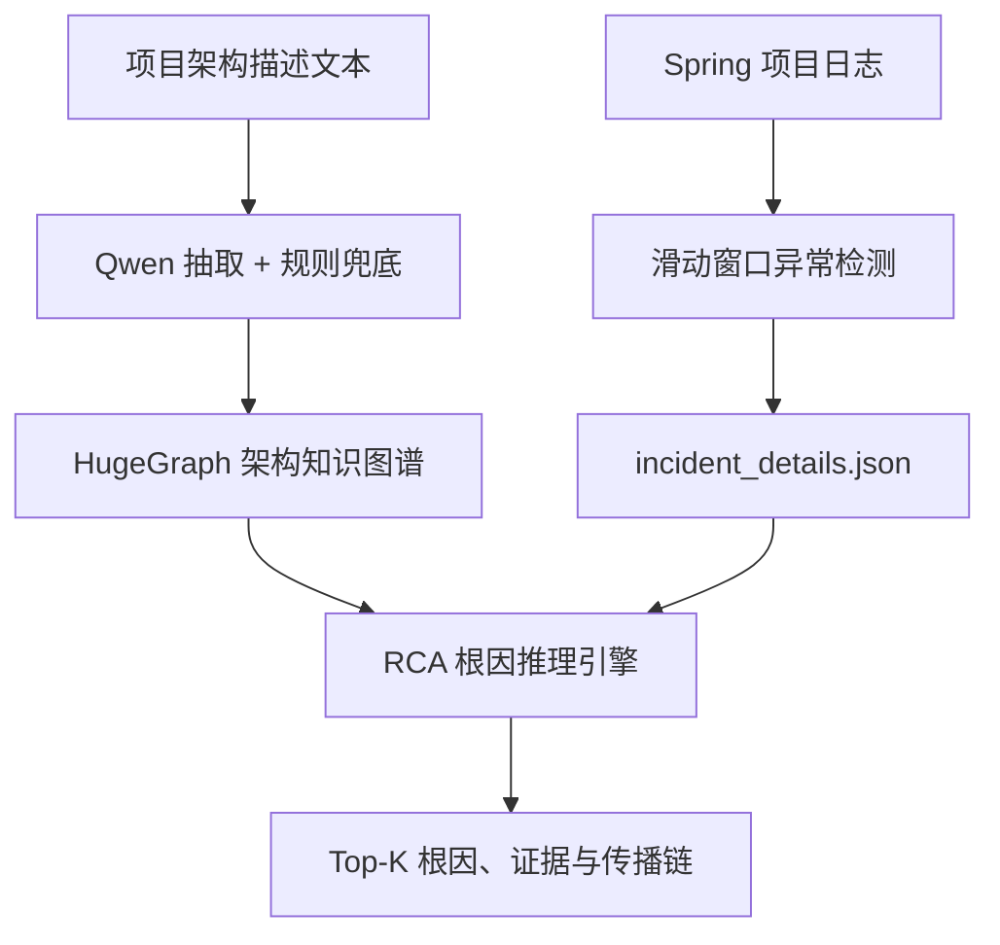

# 项目具体实现思路说明

## 1. 项目目标

本项目要解决的问题不是单纯检测“日志是否异常”，而是把异常日志放回项目真实的架构上下文中，进一步回答以下问题：

1. 哪一段时间发生了异常？
2. 哪些服务和日志属于同一次故障？
3. 日志中最底层的异常是什么？
4. 该异常对应架构图中的哪个服务、数据库、中间件、集群或实例？
5. 故障可能从哪个组件开始，并沿什么依赖链传播到最终报错的服务？
6. 当前证据能够定位到集群，还是已经足以定位到某个具体实例？

项目由两个子项目组成：

- `LogFaultAlgorithm`：负责 Spring 风格日志解析、滑动窗口异常检测和日志侧故障证据提取。
- `llm-hugegraph`：负责架构知识图谱构建、日志事件图导入、实体对齐、根因候选排序和链路生成。

本项目的核心原则是：**大模型负责抽取和解释，确定性代码负责实体匹配、图搜索、候选评分和证据约束。** 系统不会让量化后的本地大模型直接凭空猜测根因或拓扑关系。

## 2. 总体数据流



完整处理顺序如下：

1. 用户上传项目架构说明文本。
2. 本地 Qwen 模型把架构文本转换为节点和关系 JSON。
3. 若模型不可用或 JSON 不合法，则使用规则抽取器生成基础图谱。
4. 人工在原生 HTML 页面中补充、修改和确认节点、关系及实例标识。
5. 架构图写入 HugeGraph V7 图模式。
6. 用户上传 Spring 日志文件或日志 ZIP。
7. `LogFaultAlgorithm` 解析日志并通过滑动窗口定位异常区间。
8. 算法把异常窗口合并为 Incident，并生成结构化日志时间线和根因候选。
9. RCA 引擎把日志中的 service、host、IP、port 与架构图节点对齐。
10. RCA 引擎根据异常类型在依赖图中生成候选节点，并反向计算故障传播路径。
11. 系统输出 Top-K 根因假设、启发式评分、支持证据、缺失证据和完整链路。
12. 结果写回 HugeGraph，同时生成 JSON 和 Markdown 根因报告。

## 3. 架构知识图谱的构建

### 3.1 架构文本输入

架构输入可以是 `.txt`、`.md`、`.yaml` 或 `.yml` 文本。推荐文本明确描述以下信息：

- 系统包含哪些层级；
- 有哪些微服务、API、数据库、缓存和中间件；
- 哪个服务调用哪个服务；
- 哪个服务依赖哪个数据库、Redis 集群或消息队列；
- 集群包含哪些实例；
- 实例的别名、host、IP 和 port；
- Pod、进程实例与主机之间的部署关系。

例如：

```text
API网关服务的日志服务名为 api-gateway。
安全服务的日志服务名为 security-service。
API网关服务调用安全服务。
安全服务依赖 Redis生产集群。
Redis生产集群包含 redis-1、redis-2、redis-3。
redis-2 的 host=redis-2，ip=10.0.2.12，port=6379。
```

### 3.2 大模型抽取

后端的 `app/analyzer.py` 通过 llama.cpp 提供的 OpenAI-compatible `/v1/chat/completions` 接口调用本地 Qwen 模型。模型被要求只返回固定 JSON：

```json
{
  "services": [
    {
      "name": "安全服务",
      "layer": "业务服务层",
      "kind": "Service",
      "description": "负责安全配置查询",
      "meta": {"aliases": ["security-service"]}
    }
  ],
  "calls": [
    {
      "source": "安全服务",
      "target": "Redis生产集群",
      "type": "DEPENDS_ON",
      "description": "安全服务依赖 Redis"
    }
  ]
}
```

当前支持的主要架构节点类型包括：

- `System`、`Layer`
- `Service`、`API`、`Function`、`Component`
- `Database`、`Cache`、`Middleware`、`Queue`
- `Cluster`、`Instance`、`Host`、`Pod`

主要架构关系包括：

- `CALLS`：服务或 API 调用另一个服务；
- `DEPENDS_ON`：服务依赖基础设施组件；
- `USES_DB`、`READS`、`WRITES`：数据库或缓存访问；
- `PUBLISHES`、`SUBSCRIBES`：消息生产和消费；
- `HAS_MEMBER`：集群包含成员实例；
- `RUNS_ON`：实例运行在某台主机上；
- `CONNECTS_TO`：组件连接到目标组件；
- `CONTAINS`、`BELONGS_TO_LAYER`：系统层次结构。

### 3.3 规则兜底抽取

如果本地模型超时、返回思考过程、返回空内容或输出无法修复的 JSON，系统会切换到 `RuleBasedArchitectureExtractor`。

规则抽取器能够识别常见中文服务名、数据库、Redis、Kafka、集群、实例和调用关键词，也能够从文本中提取：

- `serviceName` 或日志服务别名；
- `host`；
- `ip`；
- `port`；
- Redis 集群与成员关系。

规则兜底的目标是保证导入流程不中断，但它不能替代人工确认。复杂项目仍应在前端检查和修改图谱。

### 3.4 图谱人工修改

系统管理前端位于 `frontend-system`，完全使用原生 HTML、CSS 和 JavaScript ES Modules。`frontend-vanilla` 仅是停用的旧接口演示源码。管理页面通过项目级 REST API 支持：

- 新增或更新节点；
- 修改节点类型、层级、描述和 `meta`；
- 新增关系；
- 删除节点或关系；
- 按节点类型筛选；
- 在架构页只展示静态架构节点；在单个故障详情页融合 Incident、日志证据、根因假设和相关架构子图；
- 删除传错的日志批次，并级联清理关联故障和动态证据节点。

人工修改非常重要，因为根因定位依赖真实拓扑。大模型没有在文本中看到的 Redis 实例、IP 或依赖关系，不允许自动猜测。

### 3.5 HugeGraph 存储

后端的 `app/hugegraph_client.py` 使用 HugeGraph REST API，不依赖 Gremlin。所有业务节点共用一个顶点标签，通过 `kind` 属性区分具体类型；所有关系共用一个边标签，通过 `relation_type` 区分语义。

当前默认图模式为：

```env
HUGEGRAPH_NODE_LABEL=LogSysKGNodeV7
HUGEGRAPH_EDGE_LABEL=LOGSYS_KG_RELATION_V7
```

节点的主要属性包括：

- `name`：节点唯一主键；
- `layer`：所属架构层；
- `kind`：节点类型；
- `description`：描述；
- `source_file`：数据来源；
- `meta`：别名、host、IP、port、traceId、时间戳、评分和其他扩展信息。

关系的主要属性包括：

- `relation_key`：由起点、关系类型和终点组成的唯一键；
- `relation_type`：关系语义；
- `description`：关系描述；
- `meta`：Incident、排序、评分等上下文。

## 4. Spring 日志异常检测

### 4.1 日志解析

`LogFaultAlgorithm/logfault/ingest.py` 负责读取单个 `.log`、日志目录或 ZIP。

解析器支持当前项目使用的 Spring 风格日志首行，例如：

```text
26/01/20 14:12:21.240 ERROR --- [http-nio-7100-exec-11] logger :[546d9959] message
```

解析时会提取：

- timestamp；
- level；
- service；
- instance；
- thread；
- logger；
- traceId；
- message；
- exception class；
- 最深层 `Caused by`；
- 原始多行异常栈；
- 日志文件和行号。

Java 异常栈后续没有时间戳的行会合并到同一事件，不会被错误拆成多条日志。

service 默认从日志文件名提取。例如 `security-service-7100.log` 会被规范化为 `security-service`。

### 4.2 Drain 日志模板

结构化日志随后交给 Drain3。Drain 会把变量部分替换为占位符，把相似日志归并成模板，例如：

```text
Command timed out after 20 seconds
Command timed out after 30 seconds
```

可以被归并为类似：

```text
Command timed out after <VAR> seconds
```

模板用于降低日志文本维度，并形成窗口特征。如果 Drain3 不可用，项目内置简化 fallback，但正式实验应确认 `summary.json` 中的 `parser_backend` 为 `drain3`。

### 4.3 滑动窗口特征

默认使用：

- 窗口大小：5 分钟；
- 滑动步长：1 分钟；
- 特征：`服务名::模板ID` 在窗口中的出现次数。

例如一个窗口可能形成：

```text
security-service::E00008 = 1
api-gateway::E00009 = 1
uaa-service::E00002 = 4
```

项目会把所有窗口转换为模板频率矩阵。当前代码显式把时间戳统一为纳秒精度，兼容 Pandas 2.x 和 Pandas 3.x，避免时间单位不同导致窗口为空。

### 4.4 标准化、PCA 和异常模型

窗口矩阵先经过 `StandardScaler` 做 Z-score 标准化，再进行 PCA 降维。

PCA 配置为：

- 最多 20 个主成分；
- 目标累计解释方差为 95%；
- 若 20 维仍不足 95%，报告会明确提示，而不是伪造“已达到 95%”。

异常检测模型支持：

- Isolation Forest；
- One-Class SVM。

推荐使用独立的正常日志作为 `train_input`。如果没有正常训练集，模型会在目标数据自身上训练。

当训练窗口少于 `min_training_windows`，当前实现不会信任纯模型异常标签，而会进入 `rule_fallback_small_sample` 模式，使用 ERROR、异常栈和已知底层异常信号兜底，避免小样本模型漏掉明显故障。

### 4.5 异常窗口合并和日志侧根因候选

连续或相邻的异常窗口会被合并成一个 Incident。每个 Incident 会生成：

- 检测窗口和实际故障时间；
- 涉及服务；
- traceId 列表和主 traceId；
- 日志侧根因服务候选；
- 最底层异常类；
- Top 根因日志候选；
- 同一 trace 下的日志时间线；
- 后续出现的上游错误表现。

候选日志评分会考虑：

- 是否为 ERROR；
- 是否包含最深层异常类；
- 是否命中 Redis、MySQL、Hikari 等已知底层信号；
- 是否只是 `502 Bad Gateway`、`DownstreamServiceException` 等上游表现；
- 与 Incident 开始时间的距离。

最终生成的核心文件是 `incident_details.json`。这个文件是滑动窗口算法与知识图谱之间的接口契约。

## 5. 日志图与架构图的融合

### 5.1 Incident 导入

`app/log_integration.py` 可以导入：

- `incident_details.json`；
- 包含结果文件的 ZIP；
- `incidents.csv`；
- `events.csv`。

导入后创建以下动态节点：

- `Incident`：一次合并故障；
- `Trace`：主 traceId；
- `LogEvent`：时间线日志和候选证据；
- `Exception`：日志中提取的异常类；
- `RCAHypothesis`：图谱根因假设。

### 5.2 服务实体对齐

日志中的 `security-service` 不一定与架构节点名称完全相同，架构节点可能叫“安全服务”。因此系统先执行实体对齐。

匹配顺序为：

1. 节点名完全匹配；
2. `meta.aliases`、`service_name`、`instance_id` 等标识完全匹配；
3. 去掉 `service`、`server`、`svc`、“服务”等后缀后规范化匹配；
4. 规范化名称包含匹配；
5. 无法匹配时保留日志原始 service 名称作为新服务节点。

对于实例或主机，还会检查：

- host；
- hostname；
- IP；
- endpoint；
- port；
- `host:port` 组合。

如果日志给出了端口，当前实现要求完整 endpoint 匹配，避免同一主机上不同 Redis 端口被错误合并。

### 5.3 不覆盖人工架构数据

Incident 导入前会读取现有架构节点并建立 `_known_nodes` 缓存。日志只会与已有架构节点建立关系，不会用“异常链路关联到的服务”之类通用描述覆盖人工维护的节点类型、描述、别名、IP 或端口。

这解决了旧实现中导入异常后可能把 `Database`、`Cache` 或人工 Service 节点重新覆盖为普通 Service 的问题。

### 5.4 时间关系与因果关系分离

日志时间线上前后出现的两条日志只能证明时间顺序，不能自动证明因果关系。因此当前实现使用：

- `TEMPORALLY_PRECEDES`：日志 A 在日志 B 之前；
- `CO_OCCURS_IN_TRACE`：两个服务出现在同一 trace 时间线中。

系统不会再仅根据时间顺序写入 `ERROR_PROPAGATES_TO` 并把它当成真实因果链。真正的根因传播链由 RCA 引擎根据架构依赖和故障证据单独生成。

## 6. RCA 根因推理引擎

RCA 的主要实现位于 `app/rca_engine.py`。

### 6.1 架构快照

RCA 开始时，从 HugeGraph 读取一个有界图快照，并过滤 Incident、Trace、LogEvent、Exception 和历史 RCAHypothesis 等动态节点，只保留架构节点及架构关系。

使用内存快照有两个目的：

- 使图搜索算法不依赖具体 Gremlin 方言；
- 方便编写纯单元测试，不需要每次测试都启动 HugeGraph。

### 6.2 故障信号分类

RCA 会组合以下内容：

- `root_cause_candidate`；
- 原始异常栈 `root_evidence`；
- Top 根因候选；
- WARN/ERROR 时间线；
- logger 名称。

当前内置的主要信号包括：

- `REDIS_TIMEOUT`；
- `REDIS_UNREACHABLE`；
- `DATABASE_FAILURE`；
- `DATABASE_UNREACHABLE`；
- `MESSAGE_BROKER_FAILURE`；
- `DEPENDENCY_FAILURE`；
- `APPLICATION_ERROR`。

例如同时出现 `lettuce`、`RedisCommandTimeoutException` 和 `timed out` 时，会形成 Redis 超时信号；出现 `RedisConnectionException` 和 `connection refused` 时，会形成 Redis 不可达信号。

### 6.3 候选节点生成

RCA 首先把日志侧根因服务候选解析为架构锚点。然后从该锚点沿消费者到被依赖者的方向搜索：

- `CALLS`；
- `DEPENDS_ON`；
- `USES_DB`；
- `READS`；
- `WRITES`；
- `PUBLISHES`；
- `SUBSCRIBES`；
- `CONNECTS_TO`；
- `RUNS_ON`；
- `HAS_MEMBER`。

搜索使用有界 BFS，默认最大深度为 5。只有与故障类型兼容的节点才会进入候选集合。

例如 Redis 超时优先考虑：

- `Cache`；
- `Cluster`；
- `Instance`；
- `Host`；
- 与 Redis 名称或描述直接匹配的基础设施节点。

### 6.4 存储方向与故障传播方向

架构边统一存储为：

```text
调用者或消费者 -> 被依赖者
```

例如：

```text
API网关服务 -> 安全服务 -> Redis生产集群 -> redis-2
```

但依赖故障通常反向影响消费者，因此 RCA 输出的传播方向是：

```text
redis-2 -> Redis生产集群 -> 安全服务 -> API网关服务
```

每一步都会保存 `basis`，例如：

```json
{
  "source": "Redis生产集群",
  "target": "安全服务",
  "relation": "FAULT_PROPAGATES_TO",
  "basis": "reverse_of:DEPENDS_ON"
}
```

这表示该传播步骤不是人工创建的新架构依赖，而是由已有 `DEPENDS_ON` 关系反向推导得到。

### 6.5 启发式评分

当前评分是可解释启发式分数，不是统计概率。总体形式为：

```text
候选评分
= 故障类型基础分
+ 节点名称/别名/描述匹配
+ 节点类型匹配
+ 架构路径接近度
+ host/IP/port 直接证据
+ 多类信号共同指向
- 无实例级证据时的实例惩罚
```

当前主要权重为：

| 评分项 | 分值 |
|---|---:|
| 节点名称、别名或描述直接匹配 | +0.16 |
| 节点类型与故障类型匹配 | +0.08 |
| 拓扑可达 | 最高 +0.18，距离越远越低 |
| host/IP/port 直接匹配 | +0.27 |
| 集群级候选 | +0.03 |
| 额外独立信号共同指向 | 每类 +0.03，最高 +0.09 |
| 具体 Instance/Host 无直接证据 | -0.20 |

最终分数限制在 `0.05` 到 `0.98` 之间，并映射为：

- `probable`：评分不低于 0.75；
- `suspected`：评分不低于 0.50；
- `weak`：评分低于 0.50。

评分的用途是稳定排序和解释，不应被理解为“75% 的真实故障概率”。

### 6.6 上游影响链补全

RCA 在找到“候选根因 -> 日志侧根因服务”的路径后，还会读取同一 Incident 的 `upstream_effects` 和 ERROR 时间线。

如果架构中存在：

```text
API网关服务 -CALLS-> 安全服务
```

且安全服务先出现 Redis 底层异常、API 网关随后出现同 trace 的 502，则 RCA 会把链路扩展为：

```text
Redis生产集群 -> 安全服务 -> API网关服务
```

优先使用架构调用关系。只有架构路径缺失、但日志明确标记同 trace 的后续上游错误时，才使用 `same_trace_later_upstream_error` 作为较弱依据。

### 6.7 证据边界

系统会为每个候选同时输出 `evidence` 和 `missing_evidence`。

例如应用日志只有：

```text
RedisCommandTimeoutException: Command timed out after 20 seconds
```

它能够支持：

```text
Redis 依赖路径发生超时
```

但不能单独证明：

```text
redis-2 已经宕机
```

因为超时还可能来自：

- 网络拥塞；
- Redis 慢命令；
- 连接池耗尽；
- CPU 或磁盘过载；
- 客户端超时配置过短；
- 集群重定向或槽位迁移；
- 某个节点异常，但日志没有暴露目标节点。

因此无节点证据时，集群会排在第一，具体成员会被降权。如果日志同时出现：

```text
redis-2:6379 connection refused
```

并且架构节点 `redis-2.meta.host/port` 能够匹配，则 `redis-2` 会获得 endpoint 直接证据并升为首选候选。

## 7. RCA 结果写回知识图谱

RCA 结果通过以下主要关系持久化：

| 起点 | 关系 | 终点 | 含义 |
|---|---|---|---|
| Incident | `OBSERVED_AT` | Service | 最底层日志异常出现在哪个服务 |
| Incident | `HAS_EXCEPTION` | Exception | 日志提取到的异常类 |
| Incident | `HAS_TRACE` | Trace | Incident 主 trace |
| Incident | `HAS_EVENT` | LogEvent | Incident 包含的日志证据 |
| Incident | `HAS_HYPOTHESIS` | RCAHypothesis | Top-K 根因假设 |
| Incident | `SUSPECTED_ROOT_CAUSE` | 架构节点 | 当前首选根因实体 |
| RCAHypothesis | `CANDIDATE_CAUSE` | 架构节点 | 该假设对应的候选根因 |
| RCAHypothesis | `SUPPORTED_BY` | LogEvent | 支持该假设的日志证据 |
| RCAHypothesis | `AFFECTS` | Service/API | 链路上的受影响组件 |
| Service | `EMITS` | LogEvent | 服务产生该日志 |
| LogEvent | `TEMPORALLY_PRECEDES` | LogEvent | 日志时间先后事实 |

完整候选信息保存在 `RCAHypothesis.meta` 中，包括：

- rank；
- candidate；
- candidate_kind；
- fault_mode；
- confidence；
- status；
- summary；
- chain；
- path_steps；
- evidence；
- reasons；
- missing_evidence。

## 8. Redis 示例的完整执行过程

示例架构为：

```text
API网关服务 -CALLS-> 安全服务
安全服务 -READS-> Redis生产集群
Redis生产集群 -HAS_MEMBER-> redis-1
Redis生产集群 -HAS_MEMBER-> redis-2
Redis生产集群 -HAS_MEMBER-> redis-3
```

日志过程为：

1. API 网关收到请求；
2. API 网关调用安全服务；
3. 安全服务执行 Redis GET；
4. 安全服务出现 `RedisCommandTimeoutException`；
5. API 网关随后出现同 trace 的 `502 Bad Gateway`。

日志算法先得到：

```text
root_service_candidate = security-service
root_cause_candidate = RedisCommandTimeoutException
upstream_effect = api-gateway 502
```

实体对齐得到：

```text
security-service -> 安全服务
api-gateway -> API网关服务
```

RCA 在安全服务的依赖路径中找到 Redis 生产集群及三个成员。由于日志没有给出具体节点，结果为：

| 排名 | 候选 | 评分 | 状态 |
|---:|---|---:|---|
| 1 | Redis生产集群 | 0.750 | probable |
| 2 | redis-1 | 0.495 | weak |
| 3 | redis-2 | 0.495 | weak |
| 4 | redis-3 | 0.495 | weak |

首选传播链为：

```text
Redis生产集群 -> 安全服务 -> API网关服务
```

同时报告：

```text
架构中存在三个 Redis 成员，但日志缺少目标 host/IP/port 或节点健康状态，无法确认具体成员。
```

若日志补充 `redis-2:6379 connection refused`，则 `redis-2` 会获得直接 endpoint 证据，评分提升至 0.9 以上，并形成：

```text
redis-2 -> Redis生产集群 -> 安全服务 -> API网关服务
```

## 9. 大模型在项目中的职责

当前本地模型为 llama.cpp 部署的 Qwen 14B Q4 量化模型。它适合承担：

- 从架构说明中抽取节点和关系；
- 从人工文本中抽取别名、实例和部署信息；
- 把结构化 RCA JSON 转换为自然语言报告；
- 辅助人工补充图谱描述。

它不直接承担：

- 判断图中不存在的 Redis 实例；
- 编造 host、IP、port；
- 直接生成无证据的根因；
- 代替 BFS 路径搜索；
- 代替确定性评分；
- 把日志时间顺序直接解释为因果关系。

这种划分可以降低本地量化模型的幻觉风险，也便于对每一个根因结果进行审计和复现。

## 10. API 与输出文件

主要 API：

- `POST /api/import`：导入架构说明并构建架构图；
- `POST /api/incidents/import`：导入已有日志算法结果并执行 RCA；
- `POST /api/logs/analyze`：直接运行日志算法，然后执行图谱融合和 RCA；
- `GET /api/graph`：读取当前图谱；
- `GET /api/incidents/{incident_id}/rca`：读取已持久化的根因候选；
- `/api/nodes`、`/api/edges`：图谱人工编辑；
- `GET /api/debug/hugegraph`：HugeGraph 连接检查；
- `GET /api/debug/llm`：本地模型连接检查。

`LogFaultAlgorithm` 主要输出：

- `events.csv`；
- `templates.csv`；
- `window_features.csv`；
- `window_embeddings.csv`；
- `anomaly_windows.csv`；
- `incidents.csv`；
- `incident_details.json`；
- `root_cause_report.md`；
- `summary.json`；
- `model_artifacts.joblib`。

图谱 RCA 额外输出：

- `rca_results.json`：完整机器可读 Top-K 结果；
- `kg_rca_report.md`：根因、评分、传播链和缺失证据的可读报告。

## 11. 当前实现边界

当前版本已经完成从日志异常窗口到架构根因候选的闭环，但仍有以下边界：

1. 日志格式主要针对当前 Spring 格式，其他 Logback pattern 需要增加解析配置或正则模板。
2. traceId 需要在跨服务日志中一致传播，否则只能依靠时间和架构关系做弱关联。
3. 架构图必须包含真实依赖方向、集群成员和实例标识；缺失拓扑无法通过大模型可靠补齐。
4. 当前评分是规则化启发式排序，还没有使用已标注故障数据进行概率校准。
5. 单凭应用日志通常只能确认“依赖超时或不可达”，未必能确认“物理主机宕机”。
6. 当前 RCA 读取有界内存图快照，超大规模图谱后续需要服务域裁剪、索引查询或 HugeGraph 原生邻域查询。
7. 不同机器存在时钟偏差时，日志时间线可能乱序，需要 NTP 校准或使用 trace span 时间。

## 12. 推荐的下一阶段

生产化的优先方向不是继续增加大模型提示词，而是补充运行时证据：

1. 接入 Redis Sentinel/Cluster 节点状态；
2. 接入 Kubernetes Pod 重启、OOM 和探针失败事件；
3. 接入主机 CPU、内存、磁盘和网络指标；
4. 接入 Redis 慢日志、连接数、延迟和槽位迁移信息；
5. 将这些信息统一建模为带时间戳的 `Observation` 或 `Metric` 节点；
6. 使用 traceId、实体标识和时间窗口把 Observation 关联到同一 Incident；
7. 用人工确认结果标注 `confirmed/rejected`，逐步形成故障评测数据集；
8. 统计 Top-1、Top-3 命中率、平均定位时间和误报率；
9. 再使用标注数据调整评分权重或训练监督排序模型。

最终目标是形成以下证据链：

```text
应用异常日志
+ Redis 目标 endpoint
+ Redis 节点健康状态
+ Pod/主机事件
+ 架构依赖路径
= 可审计、可解释、可人工确认的根因结论
```

这就是当前项目的整体实现思路：先用滑动窗口找到异常时间和日志证据，再用知识图谱提供系统结构，通过确定性的实体对齐、依赖反向遍历和证据评分得到根因候选，最后让大模型负责把结构化结果转换为便于阅读的解释文本。
