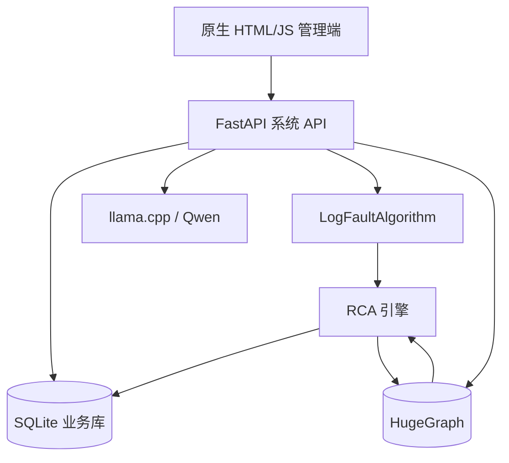

# LogScope RCA 系统实现说明

## 1. 系统定位

LogScope RCA 是一个单机可运行、多用户隔离的项目级故障分析系统。它把以下三类数据放进同一个业务闭环：

1. 项目与人员：谁创建了项目、谁处理了故障、故障是否已解决。
2. 静态知识：服务、API、数据库、Redis 集群、实例、主机及依赖方向。
3. 动态证据：日志事件、异常窗口、Trace、底层异常、RCA 候选和传播链。

系统不是让大模型直接猜根因。大模型用于把自然语言架构描述整理为结构化节点和关系；日志检测、实体匹配、图路径搜索、评分和证据约束由确定性代码完成。

## 2. 总体架构



各组件职责：

| 组件 | 职责 | 不负责的事情 |
| --- | --- | --- |
| 原生前端 | 登录、项目、架构校正、日志上传、RCA 查看、故障关闭 | 不在浏览器中执行模型推理 |
| FastAPI | 鉴权、权限校验、流程编排、文件管理、REST API | 不把 SQLite 当作图数据库 |
| SQLite | 用户、会话、项目、版本、批次、故障状态、解决记录 | 不做拓扑遍历 |
| HugeGraph | 架构实体、异常实体、关系、RCA 假设图 | 不替代工单和审计存储 |
| Qwen/llama.cpp | 架构文本抽取、失败时可由规则兜底 | 不凭空确认某台服务器宕机 |
| LogFaultAlgorithm | Spring 日志解析、Drain、滑动窗口、PCA、异常检测、日志侧根因证据 | 不知道项目真实部署拓扑 |
| RCA 引擎 | 实体对齐、候选生成、依赖图搜索、评分、证据缺口 | 评分不是统计概率 |

## 3. 用户操作流程

### 3.1 登录与项目

1. 第一个注册用户自动成为管理员，密码使用 PBKDF2-SHA256 加盐哈希保存。
2. 登录后后端签发随机 Bearer Token，SQLite 只保存 Token 的 SHA-256 摘要和过期时间。
3. 用户只允许访问自己创建的项目。对无权访问的项目统一返回 404，避免泄漏项目 ID。
4. 删除项目在当前版本中实际执行“归档”，避免误删图谱和历史结果。

### 3.2 架构图谱

1. 用户进入项目并上传 UTF-8 的 Markdown 或文本架构说明。
2. `GraphBuilderService` 调用本地 Qwen，把文本抽取为 `services` 和 `calls` JSON。
3. 抽取失败时使用规则兜底；成功或失败都记录为一个架构导入版本。
4. `ProjectScopedGraphClient` 给节点名加内部前缀 `project::<project_id>::`，再写入 HugeGraph。
5. 前端读取时去掉前缀，只返回当前项目节点和两端都属于当前项目的关系。
6. 架构页面进一步过滤 `Incident`、`Trace`、`LogEvent`、`Exception`、`RCAHypothesis` 和日志临时发现的服务，只形成纯静态架构投影。
7. 用户可在大尺寸 SVG 画布、节点管理表和关系管理表中新增、编辑、删除。节点改名会重建主键并迁移全部相邻关系；关系可修改端点、类型、描述和元数据。

RCA 所需的最小拓扑必须按“调用者/消费者指向被依赖者”保存：

```text
api-gateway -CALLS-> order-service
order-service -DEPENDS_ON-> Redis生产集群
Redis生产集群 -HAS_MEMBER-> redis-1
Redis生产集群 -HAS_MEMBER-> redis-2
Redis生产集群 -HAS_MEMBER-> redis-3
```

实例节点建议维护可观测系统会输出的标识：

```json
{
  "name": "redis-2",
  "kind": "Instance",
  "meta": {
    "aliases": ["redis-node-b"],
    "host": "redis-2",
    "ip": "10.0.2.12",
    "port": "6379",
    "endpoints": ["redis-2:6379", "10.0.2.12:6379"]
  }
}
```

没有 `host/IP/port`，系统可以定位到 Redis 集群，却不能可靠区分集群中的具体成员。

### 3.3 日志分析

1. 用户上传单个 Spring 日志、文本日志或日志 ZIP；可选上传正常历史日志作为训练集。
2. 系统创建独立 `log_batch`，原始文件和输出写到 `data/projects/<project_id>/logs/<batch_id>/`。
3. LogFaultAlgorithm 解析多行 Java 异常栈，提取时间、等级、服务、logger、traceId、异常类和最深层 `Caused by`。
4. Drain3 把相似日志归并为模板。
5. 系统按窗口大小和滑动步长统计“服务 + 模板”的频率向量。
6. 特征经标准化和 PCA 后交给 Isolation Forest 或 One-Class SVM。
7. 小样本下模型结果不可靠时，系统使用 ERROR、异常栈和已知底层错误规则兜底。
8. 连续异常窗口合并为 Incident，并生成 `incident_details.json`。
9. 每个日志批次的算法编号会从 `I00001` 重新开始，因此写图前改成 `<batch_id前缀>:I00001`，防止覆盖旧故障。
10. 用户上传错误时可以删除整个日志批次；系统会级联删除 SQLite 故障/操作记录、磁盘输入与分析产物，以及该批次在 HugeGraph 中创建的动态节点。该操作不可恢复并要求前端二次确认。

### 3.4 RCA 与故障处理

1. RCA 引擎先把日志的 `root_service_candidate` 对齐到架构服务节点。
2. 从底层异常文本识别故障模式，例如 Redis 不可达、Redis 超时、数据库故障或消息中间件故障。
3. 从故障服务沿 `CALLS`、`DEPENDS_ON`、`USES_DB`、`HAS_MEMBER` 等边向依赖端搜索候选。
4. 候选分数综合故障特征、节点类型、名称/别名匹配、图距离和 endpoint 直接命中。
5. 因为图中边是“调用方 → 被依赖方”，故障传播链按依赖路径反向输出。
6. Top-K 假设连同评分依据、直接证据、缺失证据、路径步骤写回 HugeGraph，并在 SQLite 中生成可处理的故障记录。
7. 用户可以把故障从待处理改为处理中、已解决或已忽略。标记已解决必须填写说明；每次变化写入 `incident_actions`。
8. 单个故障详情会从 HugeGraph 提取“当前 Incident + RCA 假设 + 证据 + 相关架构链”的融合子图。日志事件节点默认隐藏，用户可按需展开；长传播链、路径依据和时间线默认折叠。

架构管理视图和故障融合视图使用不同的读模型：前者回答“系统本来怎样组成”，后者回答“本次故障如何在这套架构上传播”。动态故障节点不会出现在架构页面。

## 4. 系统究竟怎样找到根因

以“order-service 查询 Redis 超时”为例：

### 第一步：日志侧找观测起点

滑动窗口算法可能得到：

```json
{
  "root_service_candidate": "order-service",
  "root_cause_candidate": "RedisCommandTimeoutException: Command timed out",
  "primary_trace_id": "trace-7"
}
```

这只说明异常最先在 `order-service` 的底层异常栈中被观察到，并不等于 `order-service` 自己就是根因。

### 第二步：把服务放回依赖图

实体对齐找到架构中的 `订单服务`，其 `meta.aliases` 包含 `order-service`。图搜索得到：

```text
订单服务 -> Redis生产集群 -> redis-1 / redis-2 / redis-3
```

### 第三步：生成并排序候选

`RedisCommandTimeoutException` 产生 `REDIS_TIMEOUT` 信号。名称/类型匹配 Redis 的可达节点成为候选：

- Redis生产集群：故障类型匹配、在依赖路径上、距离近；
- redis-1/2/3：属于 Redis 集群，但没有任何日志直接指出哪一个实例；
- 订单服务：是观测点，但自身不是 Redis 资源，不能仅因它打印 ERROR 就排第一。

因此只有“超时”时，集群通常排在第一，实例因缺少端点证据被降权。系统会明确提示：超时也可能来自慢查询、网络拥塞、连接池耗尽或资源过载，不能断言节点宕机。

### 第四步：用实例证据收敛

如果日志还包含：

```text
Unable to connect to redis-2:6379: Connection refused
```

且 `redis-2.meta.endpoints` 中存在 `redis-2:6379`，则发生 endpoint 直接命中；`redis-2` 会显著升权。传播链变为：

```text
redis-2 -> Redis生产集群 -> 订单服务 -> API网关
```

这时结论可以写成“首选根因假设为 redis-2 不可达”，但若要升级为“已确认 redis-2 宕机”，还需要 Redis PING、Sentinel/Cluster 状态、容器重启事件或主机指标。当前系统会把这些要求列在“缺失证据”中，而不是让模型补写事实。

### 第五步：人工验证与闭环

运维人员核查 Redis 或主机状态，修复后填写解决说明，例如“redis-2 容器 OOM，扩容并重建副本，监控恢复”，再标记已解决。这样系统既保存机器推断，也保存最终人工事实。

## 5. SQLite 数据模型

| 表 | 关键字段 | 用途 |
| --- | --- | --- |
| `users` | username, password_hash, role | 用户账户 |
| `sessions` | token_hash, user_id, expires_at | 登录会话 |
| `projects` | owner_id, name, status | 项目空间 |
| `architecture_imports` | project_id, source_text, counts, status | 架构版本和抽取历史 |
| `log_batches` | project_id, input/output path, summary, status | 日志分析批次 |
| `incidents` | batch, severity, status, root, score, chain, analysis | 可处理故障与 RCA 快照 |
| `incident_actions` | incident_id, actor, action, note | 状态和解决审计 |

SQLite 使用 WAL 和外键。它适合当前单机 MVP；多副本生产部署应迁移到 PostgreSQL。

## 6. 主要代码模块

### 后端

- `app/system_api.py`：完整系统 REST API 和流程编排。
- `app/system_db.py`：SQLite schema 与仓储方法。
- `app/auth.py`：密码哈希、Token 会话和鉴权依赖。
- `app/scoped_graph.py`：HugeGraph 项目命名空间和读隔离。
- `app/analyzer.py`：Qwen 架构抽取和规则兜底。
- `app/service.py`：架构抽取结果写图。
- `app/log_integration.py`：调用 LogFaultAlgorithm、动态事件写图和批次编号隔离。
- `app/rca_engine.py`：实体对齐、故障签名、候选搜索、评分和传播链。

### 前端

- `js/app.js`：启动、会话恢复和页面调度。
- `js/api.js`：统一后端请求和 Bearer Token。
- `js/router.js`：Hash 路由。
- `js/shell.js`：项目导航框架。
- `js/graph-view.js`：无第三方依赖的 SVG 图谱。
- `js/pages/*.js`：各业务页面。

## 7. API 分组

```text
POST   /api/auth/register
POST   /api/auth/login
GET    /api/auth/me
POST   /api/auth/logout

GET    /api/projects
POST   /api/projects
GET    /api/projects/{project_id}/dashboard
PUT    /api/projects/{project_id}
DELETE /api/projects/{project_id}

POST   /api/projects/{project_id}/architectures/import
GET    /api/projects/{project_id}/architectures
GET    /api/projects/{project_id}/graph
POST   /api/projects/{project_id}/graph/nodes
PUT    /api/projects/{project_id}/graph/nodes/{name}
DELETE /api/projects/{project_id}/graph/nodes/{name}
POST   /api/projects/{project_id}/graph/edges
PUT    /api/projects/{project_id}/graph/edges

POST   /api/projects/{project_id}/logs/analyze
GET    /api/projects/{project_id}/logs
GET    /api/projects/{project_id}/logs/{batch_id}
DELETE /api/projects/{project_id}/logs/{batch_id}

GET    /api/projects/{project_id}/incidents
GET    /api/projects/{project_id}/incidents/{incident_id}
GET    /api/projects/{project_id}/incidents/{incident_id}/graph
PATCH  /api/projects/{project_id}/incidents/{incident_id}/status
```

Swagger 位于 `http://127.0.0.1:8000/docs`。

## 8. 当前 MVP 边界与生产演进

当前版本能在一台机器上跑通完整闭环，但正式生产前应完成：

1. 把同步日志分析迁移到 Celery/RQ + Redis，增加任务进度、取消、重试和并发限制。
2. SQLite 迁移 PostgreSQL；项目权限从“单 owner”扩展为成员和 RBAC。
3. 前后端同域 HTTPS，Bearer localStorage 改为安全 Cookie，增加 CSP、登录限流、密码策略和审计导出。
4. 当前已有 ZIP 路径穿越、文件数和解压总体积限制；生产环境还应增加压缩比、文件类型和病毒扫描策略。
5. HugeGraph 改用服务端带 `project_id` 的查询或独立图/图空间；当前客户端先拉取有界快照再过滤，适合 MVP 数据量。
6. 架构导入增加“草稿 → 人工确认 → 发布”状态，RCA 只使用已发布版本。
7. 接入 Redis/Sentinel、Kubernetes、Prometheus、SkyWalking/OpenTelemetry 等证据源，支持对 Top-K 假设进行自动验证。
8. 建立带真实根因标签的故障数据集，评估 Top-1/Top-3 命中率、平均定位时间和误报率，并校准当前启发式评分。

## 9. 验证方法

```bash
# 后端与 RCA 单元/API 测试
cd llm-hugegraph
PYTHONPATH=backend pytest -q backend/tests

# 滑动窗口算法测试
cd ../LogFaultAlgorithm
PYTHONPATH=. pytest -q

# 检查所有原生 JavaScript 语法
cd ../llm-hugegraph
for file in frontend-system/js/*.js frontend-system/js/pages/*.js; do node --check "$file"; done
```

测试覆盖账户/项目生命周期、项目间图谱隔离、故障解决说明、Redis 集群/实例证据边界、RCA 持久化读取和日志算法兼容性。
